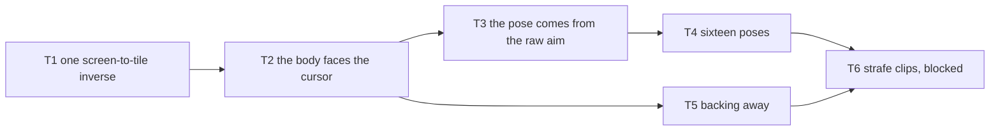

# Design: Decoupled Movement And Aim

## Context & Problem

WASD moves the survivor and his body turns the way he walks, so he can only look
where he goes. `docs/concept.md` ("Controls", "Combat Mechanics") asks for the
opposite: the mouse aims, there is no auto-targeting, and attacks can miss. Once
he can back away from a pack while still pointing a weapon at it, retreat
becomes a real choice rather than a surrender, and every combat system after
this one rests on that. Marrowfall draws pre-rendered sprites rather than a
turning 3D mesh, so the split is not free: a body that faces one way while it
travels another needs pixels that do not exist yet.

## In Scope

- The mouse sets where the survivor points, and WASD moves him by the screen.
- The simulation owns an exact aim, so attacks, cones and line of sight can read
  it.
- The sprite shows one of sixteen poses, picked from that exact aim.
- Traveling away from the cursor plays a backward clip and costs speed.
- Every direction of travel reads about as fast as every other on screen.
- The art pipeline bakes and packs sixteen directions.

## Out of Scope

- **Attacks and every other discrete action:** `Intent` stays uninhabited, and
  aim must feel right before an attack is judged. One answer is settled already,
  because it decides the clip matrix: **an attack roots him.** No clip combines
  locomotion with an attack, so the clip count stays locomotion plus attacks and
  never locomotion times attacks. Diablo II and Dark Souls both work this way,
  and `docs/concept.md` puts attacks and dodges on a stamina budget, so
  committing to a swing is the risk that budget exists to create. Path of Exile
  2 moves during attacks by blending additively at runtime, a skeletal 3D
  technique: Godot's `BlendSpace2D` will not interpolate sprite frames. The
  escape hatch needs its own spike. Blend once in Blender and bake the result,
  at a cost of locomotion states times attacks: 20 clips and 25 minutes of bake
  for a four-by-five set, multiplying with weapon classes.
- **A reticle, a cone or an aim line:** the cursor already shows where the
  player points, and `docs/concept.md` asks for a minimal HUD.
- **Aim for anything that is not the player:** an NPC archer needs its own
  `Aim`, and no NPC exists. Everything else still turns the way it moves.
- **A turn rate, deferred:** turning is instant. A rate earns its place once an
  attack commits him to a direction. The stored continuous aim makes it one
  system and one constant later.
- **Thirty-two poses, deferred:** sixteen ships and was judged, and thirty-two
  never has been. It already works in the pipeline and costs a 12 minute
  re-bake.
- **Moving `ISO_SPEED_COMPENSATION` to `0.0`, deferred:** held at `0.5` until
  real terrain and the first ranged attack exist. See the speed decision.
- **Equipment layering:** which items show, how layers stack, and what draws in
  front of what at each angle, is a design of its own that needs real items to
  test against. Diablo II needed a draw order per direction *and* per frame.
- **A real-time 3D renderer:** it would make the pose count, the clip matrix and
  per-item equipment bakes all disappear, and the 3D source assets exist. It is
  rejected because the sprite pipeline works and the look is established.
  Revisit when the equipment catalog passes roughly 20 distinct pieces, a
  rotatable camera is wanted, or the clip count passes 12.
- **Gamepad aim:** the right stick gives this same value shape, needing four
  actions.
- **Cursor confinement:** Godot's confined modes carry open bugs, and nothing
  needs it.
- **Analog movement and runtime blending between clips:** unchanged from the
  previous milestone. Sprites are pixels.

## Terminology

- **Aim:** where the player asks the survivor to point, in tile space, unit
  length. It comes from the cursor, never from the keys.
- **Facing:** an entity's stored direction, one of eight. Coarse gameplay state
  that every entity carries, including the ones with no cursor.
- **Stride:** which way an entity travels against where it points: forward,
  backward or a strafe, which is sideways travel while still pointing straight
  ahead.
- **Clip:** one animation, such as `run`, packed as one atlas with one row per
  pose.
- **Row, or pose:** one horizontal strip of an atlas, holding every frame of one
  clip from one direction. One of the sixteen bodies the bake rendered, and
  cosmetic only.
- **Wedge:** the slice of the world that maps to one row. At sixteen rows each
  wedge is 22.5 degrees of world angle.
- **Dead radius:** the pixels around the survivor where the cursor is too close
  to trust.
- **Moonwalking:** a forward run cycle playing while the body travels another
  way.

## Key Decisions

Several of these were settled by building the option and playing it, which is
said outright where it happened, because a played result beats an argued one.

### What do the movement keys point at, the screen or the cursor?

Once the mouse owns the facing, the keys need their own frame of reference.

#### ✅ Option 1: The screen. `W` is up-screen whatever the aim

The keys keep the meaning they have today, and the aim changes none of it.
Movement stays eight directional and the body turns independently.

```rust
let held = iso::screen_dir_to_tile(held_direction(self.focused));
sim.set_input(Input::new(held).aiming(aim));
```

**Pros:**

- A key always moves him the same way, so the control never inverts.
- Path of Exile 2 and Diablo IV both ship it, and Path of Exile 2's WASD mode is
  eight directional too.
- The keys do not change, so the previous milestone's tests still hold.

**Cons:** circle-strafing is manual. The player turns the keys by hand as he
orbits.

**Rationale:** Path of Exile 2's own forum proves the scheme. A player in thread
3654665 complains the character "moves without facing the direction of movement
(for example, running backward)" and must keep repositioning the cursor to line
the two up. Facing and travel disagree that way only if the keys are pinned to
the screen.

#### ❌ Option 2: The cursor. `W` walks toward where he points

The keys are read in the aim's frame, so `W` advances, `S` retreats, and `A` and
`D` orbit the cursor.

```rust
let right = Vec2::new(aim.y, -aim.x);
let held = aim * keys.y + right * keys.x; // the frame turns with the aim
```

**Pros:** free circle-strafing, and movement never fights facing, so no clip
shows a strange gait.

**Cons:** left and right invert the moment the aim passes horizontal, because
the body then faces the camera and the player's left is his right.

**Rationale:** Rejected by playing it. That inversion is the classic
tank-controls fault, and no sign flip removes it, because the frame really does
turn through the player. Path of Exile 2 lands on the same answer.

### Does an attack read the sprite's pose or the raw cursor?

Sixteen rows means the drawn body is up to 11.25 degrees of world angle from
where the cursor really points.

#### ✅ Option 1: The snapshot publishes both, and accuracy reads the exact one

`EntityView` carries an exact unit `aim` and a `facing` snapped to eight. The
sprite row comes from `aim`, snapped to however many rows the atlas has.

```rust
pub struct EntityView {
    pub facing: Facing, // coarse, always present, gameplay state
    pub aim: Vec2,      // exact, unit length, what an attack reads
}
```

**Pros:**

- The pose count can never cost the player a shot, so choosing it is a question
  about how the game looks and never about how it plays.
- The renderer asks the atlas how many rows it has, so changing the count is a
  re-bake and no code change.
- `docs/concept.md` promises no auto-targeting and attacks that can miss. A
  quantised aim would decide the miss for the player.

**Cons:** the drawn body and the real aim disagree by up to half a wedge, so a
shot can leave a little off the drawn pose. One more field on the boundary.

**Rationale:** The most load-bearing decision here. It uncouples the art bill
from the feel of combat, which is what let the pose count be settled by eye.
Every entity publishes a usable `aim`, because one with no `Aim` component falls
back to `facing.axis()`.

#### ❌ Option 2: One direction, quantised once, used for everything

The simulation stores only `Facing`, and an attack fires along `facing.axis()`.

```rust
let shot = view.facing.axis(); // the sprite decides where the arrow goes
```

**Pros:** one direction in the whole system, so the sprite can never lie, and
less to carry across the boundary.

**Cons:** aiming resolution becomes an art decision, and every future change to
the pose count changes the balance of the game.

**Rationale:** Rejected. That is exactly the coupling worth one `Vec2` to avoid.

### How many poses does the survivor have?

The bake spins the model in front of a fixed camera and saves a picture at each
stop. The number of stops is the number of poses.

Every figure below is measured. A frame costs about 0.23 seconds at the
pipeline's real 512 render size with EEVEE. Godot imports the atlases as BC7
(`compress/mode=2` with `imported_formats: ["s3tc_bptc"]`), exactly one byte per
pixel, proven by measuring the imported `.ctex` files. The packer reaches 88.6
percent efficiency, and today's three clips are 53 frames per direction against
95 for the target five. Memory scales with species and not instances:
`bridge.rs` shares one texture per clip.

| Poses | Frames today | Bake today | VRAM today | VRAM at five clips |
| --- | --- | --- | --- | --- |
| 8 | 424 | 1.6 min | 10.8 MB | 19 MB |
| 16 | 848 | 3.3 min | 22 MB | 39 MB |
| 32 | 1,696 | 6.5 min | 43 MB | 78 MB |

#### ✅ Option 1: Sixteen

```ron
bake: Bake(directions: 16, render_size: 512, sprite_height: 240, ..)
```

**Pros:**

- Diablo II shipped 16 for player characters and 8 for monsters, confirmed from
  Blizzard North's postmortem and by parsing all 3,511 of its shipped `.cof`
  files. This is the proven number for this camera and this art style.
- 3.3 minutes of bake and 22 MB of VRAM for the whole character.
- It is what makes a turn rate worth adding later.

**Cons:** twice the atlas of eight, forever, for every character.

**Rationale:** Confirmed by playing it. Direction count was treated as expensive
and it is not. The measured bake is minutes, and one character is a fraction of
one modern texture budget.

#### ❌ Option 2: Eight

What shipped in the previous milestone, and Diablo II's *monster* layout.

```ron
bake: Bake(directions: 8, ..)
```

**Pros:** no art bill and no re-bake.

**Cons:** the body holds a pose for a long sweep of the cursor and then jumps.

**Rationale:** Rejected on screen. Aim reads notchy, the one thing this work
fixes.

#### ❌ Option 3: Thirty-two

```ron
bake: Bake(directions: 32, ..)
```

**Pros:** the body stops reading as quantised at all, and it already works.
`pack.rs` and `framing.py` both carry the 32 ring, numbered from south because
the compass runs out of names.

**Cons:** 78 MB for one character at the target clip set, and a 12 minute bake.

**Rationale:** Deferred rather than rejected. Sixteen was judged and passed, and
thirty-two has never been judged.

#### ❌ Option 4: Make each pose cheaper instead of keeping the ring small

Two ways to afford more poses. Render `N / 2 + 1` of them and flip the rest at
pack time, which is nine bakes for sixteen rows. Or compress the atlases harder.

```rust
let flipped = imageops::flip_horizontal(&frame); // a new pack stage
```

**Pros:** mirroring almost halves the bake and the atlas, and a smaller format
would make thirty-two cost what sixteen costs today.

**Cons:** mirroring is blocked twice over. Layered equipment swaps the weapon
and shield hands under a flip, which is why Diablo II did not mirror, and
`KEY_LIGHT_AZIMUTH_DEG = 315.0` is baked into the albedo, 45 degrees off the
mirror axis, so a flipped frame is lit from the wrong side beside unflipped
neighbours. Compression fails on every candidate. ASTC has about 12 percent
desktop support and ETC2 about 16, so neither can be the only shipped format.
Basis Universal transcodes to the BC7 that already ships, saving download size
and no VRAM. BC1 would destroy antialiased edges, and 82 percent of the blocks
here carry transparency. Palette indexing is dead at one byte per pixel.

**Rationale:** Both rejected. The bake is 3.3 minutes, so mirroring saves
nothing worth a lighting seam, and no compression win is left to spend on more
poses.

### Are the bake's stops spaced evenly in the world or on the screen?

The 2:1 diamond squashes equal world wedges into unequal screen ones. Screen
angle follows `tan(screen) = tan(tile + 45 degrees) / 2`. The narrow wedges sit
around straight left and right, and the wide ones around straight up and down.

| Poses | World wedge | Narrowest on screen | Widest on screen |
| --- | --- | --- | --- |
| 8 | 45.0 | 23.4 | 79.3 |
| 16 | 22.5 | 11.4 | 43.4 |
| 32 | 11.25 | 5.6 | 22.3 |

#### ✅ Option 1: Evenly in the world

```python
return -(2.0 * math.pi / count) * index
```

**Pros:** equal resolution in the *world*, which is where gameplay happens. The
distribution is honest, because the screen unevenness is only the projection.
Diablo II ships this.

**Cons:** the body tracks the cursor about four times more closely sideways.

**Rationale:** Kept after playing both on a toggle.

#### ❌ Option 2: Evenly on the screen

Invert the projection when choosing each stop, so every wedge is `360 / count`
degrees wide as the camera sees it.

```python
wanted = math.radians(90.0) + 2.0 * math.pi * index / count
return -(math.atan2(math.sin(wanted), math.cos(wanted) / 2.0) - math.radians(90.0))
```

**Pros:** the pose tracks the cursor at the same rate everywhere on screen.

**Cons:** redistribution is zero sum. Evening the wedges widens the sharpest
region as much as it narrows the mushiest. At sixteen the narrow band goes from
11.4 degrees to 22.5, which is twice as coarse.

**Rationale:** Rejected after it was built, baked and played against the
world-uniform set. It felt worse, because the screen is wider than it is tall,
so a player spends most of their aim in the band this change makes coarser. The
lesson: the answer to a pose being too coarse is more poses, never a
rearrangement of the same ones.

### How many frames does a locomotion clip have?

#### ✅ Option 1: About 20

The bake samples each action at its authored rate, so the count follows from
that rate and the action's length. `run` is 20 frames at 24 fps.

```ron
"run": Animation(skeleton: "humanoid", loops: true, fps: 24, source: Meshy(action_id: 15)),
```

**Pros:** the gait reads as motion rather than as a flip book.

**Cons:** two and a half times the atlas and the bake of Diablo II's count.

**Rationale:** Kept by eye. 8 and 10 were both built and both judged
unacceptable on screen, and 12 was only passable.

#### ❌ Option 2: Eight, Diablo II's count

```ron
"run": Animation(.., fps: 10, ..)
```

**Pros:** less than half the atlas and less than half the bake.

**Cons:** the run cycle strobes at this screen size and this sprite height.

**Rationale:** Rejected on screen. Diablo II drew a much smaller character on a
much smaller display, so its number does not transfer.

### What does the body show when the aim and the travel disagree?

Today the drawn row is the direction he walks, so "where he faces" and "where he
goes" are one fact and one `run` atlas answers everything. Once the mouse owns
the facing, the sprite answers two questions at once: the row says which way he
points, and the clip says which way he travels relative to that. So one clip per
stride.

#### ✅ Option 1: Four locomotion clips, one per stride, and backing away is slower

`run`, `walk_back`, `strafe_left` and `strafe_right`. The stride comes from his
travel measured against where he points, and the backward stride runs at 55
percent speed.

```rust
pub enum Locomotion { Idle, Forward, Backward, StrafeLeft, StrafeRight }
pub const BACKWARD_SPEED: f32 = 0.55;
```

**Pros:**

- His feet always push the way he really goes, so nothing moonwalks.
- Retreat costs something, which is the point of a punishing combat design. It
  also fixes a foot slide, because `walk_back` is authored for a walking gait
  and reads as frantic at running speed.
- No change to the manifest format and none to the boundary shape.

**Cons:** four times the atlas of one clip, two of the four clips do not exist
yet, and diagonal travel rounds to the nearer stride, so the gait is up to 45
degrees off.

**Rationale:** The rounding error on a diagonal is the same one a four-way blend
tree gives in 3D, and it is invisible beside moonwalking, the most obvious
mistake a character can make. The speed penalty is a combat decision, not a
graphics one, and it was judged by playing. One speed in every direction is
simpler and was rejected, because free retreat removes the pressure the stamina
system creates.

#### ❌ Option 2: One clip, row from the aim

He points at the cursor correctly and his legs always run the way he points.

```rust
let clip = Clip::Run; // always
```

**Pros:** free.

**Cons:** backing away moonwalks. The run cycle pushes forward while the body
slides backward, and it reads as a bug.

**Rationale:** Rejected. It fails hardest in the situation the feature exists
for.

#### ❌ Option 3: One clip, row from movement, aim shown by a reticle

The body walks normally and a marker on the ground shows where he points.

```rust
reticle.set_global_position(cursor); // a new node, no new art
```

**Pros:** free, no moonwalk, and the simulation still owns a real aim.

**Cons:** the attack comes out of his back, and the body, which is what the eye
watches, says nothing about where he points.

**Rationale:** Rejected. It does not deliver the feature, and a HUD overlay
fights the minimal HUD line in `docs/concept.md`.

#### ❌ Option 4: Change the bake instead of buying clips

Twist the spine at bake time so his legs run forward while his chest turns to
the cursor. Or render the torso and the legs as separate sprites and pair them
at runtime, which is what 2D twin-stick shooters do.

```python
apply_spine_twist(character.armature, degrees=settings.twist)
```

**Pros:** no new motion to buy, and the pipeline already composes a bone
rotation onto an imported action.

**Cons:** a person cannot twist 180 degrees, so the twist cannot show retreat.
The split sprite can, but the bake renders whole bodies, and rotating a baked
isometric torso is not a 2D rotation, so that is a new pipeline. Both turn a row
into direction crossed with something else, which changes the manifest.

**Rationale:** Rejected. The twist cannot show the signature move, and the split
would fight the layered equipment design that comes later.

### What crosses the boundary, a direction, a point, or pixels?

The simulation must not learn about pixels, and `snapshot.rs` already forbids a
frontend from quantising a screen angle.

#### ✅ Option 1: A unit direction in tile space, on `Input`

The frontend measures the cursor against the middle of the viewport, then reuses
the inverse the keys use. The camera pins him to the middle of the screen, so
"offset from the middle" and "offset from the survivor" are the same
measurement.

```rust
let offset = viewport.get_mouse_position() - viewport.get_visible_rect().size / 2.0;
if offset.length() < DEAD_RADIUS { return Vector2::ZERO; }
```

**Pros:**

- Reuses a tested function, so viewport scale and camera zoom both cancel, and
  it never reads the canvas transform, so a live Godot bug cannot reach it.
- A gamepad right stick gives a direction natively, with no shape change.
- Zero already means "no request" here, so the dead radius and a lost window
  focus need no special case.

**Cons:** correct only while the camera is pinned to the survivor. A camera
offset or lead would have to be subtracted here too.

**Rationale:** A direction is what the player perceives. The camera follows him,
so a cursor held still on screen means a fixed direction relative to him, not a
fixed point in the world. The drawn row comes back out of the snapshot, the way
position and locomotion already do, at a cost of one tick plus one frame that
held movement pays.

#### ❌ Option 2: A point in tile space, or raw screen pixels

```rust
sim.set_input(Input::new(held).aiming_at(screen_point_to_tile(cursor)));
sim.set_input(Input::new(held).aiming(cursor)); // or a Vector2, in pixels
```

**Pros:** a point stays correct through a catch-up burst, because it does not
move while the survivor does. Raw pixels ask the frontend to do nothing at all.

**Cons:** a point swings the aim through 180 degrees when he runs past it, the
opposite of what a player holding the mouse still expects, and it needs a new
inverse that knows the camera, the zoom and the viewport. Raw pixels put
`TILE_WIDTH`, `TILE_HEIGHT` and the camera into the crate whose whole point is
having no pixels.

**Rationale:** Both rejected. The point costs a new inverse and buys a behavior
nobody wants, and `snapshot.rs` and the `Facing` doc both forbid the pixels.

### How much of the isometric foreshortening comes out of walking speed?

The 2:1 diamond means world speed and screen speed cannot both be constant. One
is always uneven, and it shows on whichever side is not pinned.

#### ✅ Option 1: Half, `0.5`

```rust
/// `0.0` holds world speed constant, `1.0` holds screen speed constant.
pub const ISO_SPEED_COMPENSATION: f32 = 0.5;
```

**Pros:** neither failure is large. Sideways covers about 1.41 times the pixels
rather than 2.0, and crosses about 0.71 of the tiles rather than 0.5.

**Cons:** honest about neither space. Both distances depend a little on the
direction.

**Rationale:** Settled for now by playing all three, and marked to revisit.

#### ❌ Option 2: None, `0.0`. What Diablo II does

Every direction crosses the same tiles per second, and sideways covers twice the
screen pixels.

```rust
pub const ISO_SPEED_COMPENSATION: f32 = 0.0;
```

**Pros:** one tile per second means one tile per second everywhere. Every other
number in the game is measured in tiles: attack reach, area radius, aggro range,
dodge distance. The invisible failure mode disappears, where an area attack he
can outrun upward kills him sideways with nothing on screen to explain why.

**Cons:** the unevenness is real and was spotted at once on the placeholder
ground.

**Rationale:** Deferred, not rejected. A regular checkerboard is a strong cue
for how fast tiles pass, and terrain art with irregular detail hides most of it,
which is why Diablo II ships this without complaint. Retry `0.0` once real
terrain and the first ranged attack exist. That is when the invisible failure
starts to bite, and an invisible failure is worse than a visible quirk.

#### ❌ Option 3: Full, `1.0`

```rust
pub const ISO_SPEED_COMPENSATION: f32 = 1.0;
```

**Pros:** the screen reads perfectly even.

**Cons:** walking up the screen then crosses twice the tiles of walking
sideways, which is the worst version of the problem above.

**Rationale:** Rejected. It maximizes the gap between what the player sees and
what the simulation measures.

### What keeps the gait in phase when the stride changes?

`sprites::frame_at` picks a frame with `seconds * fps % frames`. `run` is 20
frames at 24 fps and `walk_back` is 18 at 20, so the same instant gives
different phases and switching clips jumps the legs mid step.

#### ✅ Option 1: One shared cycle for every locomotion clip

Play them all over the same wall-clock cycle, so the fraction through the cycle
carries across a switch.

```rust
pub const GAIT_SECONDS: f64 = 0.833; // 20 frames at 24 fps, which is `run`
let phase = (seconds.max(0.0) / GAIT_SECONDS).fract();
((phase * f64::from(atlas.frames)) as usize).min(atlas.frames as usize - 1)
```

**Pros:**

- Removes the pop with no art change, no new state and no per-clip tuning, and
  it handles clips of different lengths, which is the state the art is in.
- Established technique. Unreal's Sync Groups work the same way, by scaling
  every follower to the leader's length.
- `sprites::frame_at` is untouched and keeps serving `idle`.

**Cons:** each clip plays a little off its authored rate, so its foot slide
differs from the run's. Every clip must also be one whole cycle starting on the
same foot.

**Rationale:** That art constraint is free to state now and expensive to
discover later, so it is a success criterion on the art task and not a note.

#### ❌ Option 2: Leave `frame_at` alone

```rust
let index = sprites::frame_at(atlas, seconds); // this clip's own fps and length
```

**Pros:** nothing to write.

**Cons:** a visible hitch every time the stride changes, which is every time the
player turns while running.

**Rationale:** Rejected. The hitch lands on the exact action the feature is for.

## Architecture Overview

Nothing new crosses the boundary except one more field on the message that is
already there. No new transport, no new node, no new thread.

```text
 main thread (crates/render)          sim thread (crates/host + game)

 InputMap move_* -> get_vector --.
 Viewport mouse position minus   +-> iso::screen_dir_to_tile (one inverse,
   the viewport center           |     ISO_SPEED_COMPENSATION inside it)
                                 v
 SimHandle::set_input(Input::new(held).aiming(aim)) ==> Output<Input>::read

              Sim::tick: carry, apply_input (velocity, speed by stride,
              and Aim), apply_velocity, keep_player_on_the_field,
              apply_facing (the aim for the player, motion for the rest)

 Frame { snapshot, alpha } <========= Published { snapshot, due_at }
   -> Clip::for_locomotion picks the atlas from view.locomotion
   -> draw::row_for_aim picks the row from view.aim and the atlas row count
   -> draw::locomotion_frame picks the frame on the shared gait cycle
```

Each piece lives where its units are known. The stride and the aim sit in
`crates/game` in tile space, and the dead radius and the row lookup sit in
`crates/render`. The stride, pointing south:

| Travel while pointing south | Locomotion | Clip |
| --- | --- | --- |
| south, and up to 45 degrees either side | `Forward` | `run` |
| east | `StrafeLeft` | `strafe_left` |
| north, and up to 45 degrees either side | `Backward` | `walk_back` |
| west | `StrafeRight` | `strafe_right` |

## Third Party Dependencies

No new crate enters the workspace, and no new Godot node type is used.

| Capability | Chosen | Alternatives considered | Why |
| --- | --- | --- | --- |
| Cursor to a world direction | `Viewport::get_mouse_position` minus the viewport center, then the existing `iso` inverse | `CanvasItem::get_global_mouse_position`, `Camera2D::get_screen_center_position` plus a hand-built inverse, a `PhysicsDirectSpaceState2D` ray | The chosen route never reads the canvas transform, so godotengine/godot#81898 cannot bite it, and it reuses a function that already has tests. |
| Angle comparison in the simulation | dot and perpendicular dot products on `Vec2` | `f32::atan2`, `glam`'s angle helpers, a fixed-point angle crate | IEEE 754-2019 clause 9.2 makes `atan2` optional and not required to be correctly rounded. Replay must be bit identical. Render output is never replayed, so the row lookup may use one `atan2` instead of sixteen dot products. |
| Texture compression | BC7 through Godot's importer, already configured | ASTC, ETC2, Basis Universal, BC1, palette indexing | See the pose-count decision. None of them saves VRAM on this content. |
| Gait phase across a clip change | one shared cycle length in `render` | per-clip `fps` as today, a cross fade, Unreal-style sync markers | Sprites cannot cross fade. Markers are authored data with no authoring tool here. |
| Strafe and backward motion | deferred, see task T6 | Meshy, Mixamo, Rokoko, ActorCore, MoCap Online, commission, hand animate | Meshy has no upright strafe at all, so a second supplier is needed. Compared in practice rather than on paper. |

## Structure

```text
game/src/lib.rs        Input::aiming, Input::aim; doc update
game/src/components.rs + Aim(Vec2); Facing::name removed, it has no caller
game/src/sim.rs        + BACKWARD_SPEED, stride_of; apply_input writes Aim and
                         picks the speed; apply_facing prefers the aim
game/src/snapshot.rs   Locomotion gains the strides; EntityView gains aim
render/src/iso.rs      + ISO_SPEED_COMPENSATION, compensated
render/src/draw.rs     + row_for_aim, GAIT_SECONDS, locomotion_frame; Clip
                         gains the stride variants
render/src/bridge.rs   + cursor_offset behind the focused gate
sprites/src/lib.rs     row_for removed, the row now comes from a direction
xtask-art/src/pack.rs  direction_names answers 16 and 32
xtask-art/src/spec.rs  validate accepts 4, 8, 16 and 32
tests                  game: test_sim, test_snapshot, test_input; render:
                       test_iso, test_draw; plus sprites and xtask-art
tools/blender/src/framing.py  DIRECTION_NAMES gains 16 and 32;
                              SCREEN_UNIFORM_DIRECTIONS removed
art/animations/library.ron    + strafe_left, strafe_right; walk_back replaced
art/characters/survivor/spec.ron  directions: 16, and the new animations
project/assets/characters/survivor/  regenerated atlases, .import files and
                                     character.ron
```

Paths are relative to `crates/` except where written in full. `crates/host` is
unchanged, and `bridge.rs` stays the only file that touches `Gd<T>`.

## Specs & Standards

- **IEEE 754-2019, clauses 5.4.1 and 9.2:** addition, subtraction,
  multiplication, division and `squareRoot` are correctly rounded, and every
  comparison inside `crates/game` uses only those, so a replay is bit identical
  on any host. `atan2`, `sin` and `cos` are only *recommended* operations, and
  Rust documents their precision as non-deterministic across platforms, so no
  angle in the simulation is in radians.
  <https://doc.rust-lang.org/std/primitive.f32.html>
- **Godot `Viewport.get_mouse_position` and `get_visible_rect`:** both report in
  the viewport's own coordinates, so their difference is independent of window
  size under a uniform stretch. `project.godot` uses `canvas_items` stretch with
  `aspect="expand"`.
  <https://docs.godotengine.org/en/stable/classes/class_viewport.html>
- **Godot `AnimationNodeBlendSpace2D`:** blend spaces interpolate transforms,
  and a sprite frame is not a transform.
  <https://docs.godotengine.org/en/stable/classes/class_animationnodeblendspace2d.html>
- **RON grammar** (canonical EBNF in `ron-rs/ron`, `docs/grammar.md`) governs
  `library.ron`, `spec.ron` and `character.ron`. This design adds entries, not
  fields. <https://github.com/ron-rs/ron/blob/master/docs/grammar.md>
- **Diablo II `.cof`:** the format stores a direction count per animation, and
  the engine handles 4, 8, 16, 32 and 64. The shipped split is in the pose-count
  decision.
- **Path of Exile 2 WASD:** screen-relative and eight directional, with the
  cursor setting facing independently. Verified from forum thread 3654665.
  <https://www.pathofexile.com/forum/view-thread/3654665>
- **Unreal Engine Sync Groups:** the reference for playing related locomotion
  clips of different lengths in phase, by scaling every follower to the leader's
  length.
  <https://dev.epicgames.com/documentation/en-us/unreal-engine/animation-sync-groups-in-unreal-engine>

## Interfaces

### `crates/game`

```rust
pub struct Input { move_dir: Vec2, aim: Vec2 }
impl Input {
    pub fn new(move_dir: Vec2) -> Self;
    pub fn aiming(self, aim: Vec2) -> Self;
    pub fn move_dir(self) -> Vec2;
    pub fn aim(self) -> Vec2;
}

pub const PLAYER_SPEED: f32 = 4.0;
pub const BACKWARD_SPEED: f32 = 0.55; // a fraction of PLAYER_SPEED

/// What a character does, and which way it travels against where it points.
/// Simulation state, never a clip filename. Dodge and stagger extend this.
pub enum Locomotion { Idle, Forward, Backward, StrafeLeft, StrafeRight }

pub struct EntityView {
    pub facing: Facing,        // coarse stored direction, one of eight
    pub locomotion: Locomotion,
    pub aim: Vec2,             // exact, unit length
}
```

- `Input::new` takes a tile-space direction of at most unit length. Not finite
  becomes still, and longer is scaled back. A trust boundary against a malformed
  frontend, not input shaping.
- `aiming` is separate so a caller with no cursor, such as a test or an idle
  gamepad stick, says nothing rather than guessing. A zero aim leaves facing
  following movement.
- `tick` reads `input` once, so a skipped tick loses neither the keys nor the
  aim.
- `EntityView::facing` is `aim` snapped to eight, and an entity with no cursor
  falls back to `facing.axis()` for its `aim`.
- `Locomotion::Running` and `Facing::name` are gone, so the compiler finds every
  caller.

### `crates/render`

```rust
// iso.rs
pub const ISO_SPEED_COMPENSATION: f32 = 0.5;
pub fn screen_dir_to_tile(screen: Vector2) -> Vec2;
pub fn compensated(screen: Vector2, compensation: f32) -> Vec2;

// draw.rs
pub enum Clip { Idle, Run, WalkBack, StrafeLeft, StrafeRight }
impl Clip {
    pub const ALL: [Clip; 5];
    pub fn for_locomotion(locomotion: Locomotion) -> Self;
    pub fn name(self) -> &'static str;  // "idle" | "run" | "walk_back" | ..
    pub fn is_locomotion(self) -> bool; // false only for Idle
}
pub fn row_for_aim(atlas: &AnimationAtlas, aim: Vec2) -> Option<usize>;
pub const GAIT_SECONDS: f64 = 0.833;
pub fn locomotion_frame(atlas: &AnimationAtlas, seconds: f64) -> usize;
```

- `screen_dir_to_tile` undoes the projection for a direction, which is why `W`
  means up the screen. Zero in gives zero out, it is never longer than unit
  length, and `compensated` names the trade so a test can pin both ends.
- `row_for_aim` quantises in tile space, never on screen. It answers `None` for
  a zero aim or a rowless atlas, and the caller leaves the sprite where it was.
- `locomotion_frame` stretches a clip onto the shared gait cycle. `idle` keeps
  `sprites::frame_at`.

### Art

`art/animations/library.ron` gains `strafe_left` and `strafe_right`, and
`walk_back` gets a working source. Each entry keeps its own `fps`, because
`locomotion_frame` stretches every clip onto one cycle. The `source` field
records where the motion came from, which task T6 settles.

```ron
"strafe_left":  Animation(skeleton: "humanoid", loops: true, fps: 24, source: ..),
"strafe_right": Animation(skeleton: "humanoid", loops: true, fps: 24, source: ..),
```

## Existing Code & Reuse

- **`iso::screen_dir_to_tile`** already inverts the projection for a direction
  and already normalizes, so the cursor path reuses it whole. Two code paths
  used to convert the keys with different maths, so fixing one left the other
  wrong. One function stops that.
- **`Facing` and `Facing::from_direction`** stay exactly as they are. `Facing`
  is every entity's stored direction and the fallback that lets an entity with
  no cursor publish a usable `aim`. **`Facing::name` and `sprites::row_for` are
  removed,** because the row now comes from a direction and not from a compass
  name.
- **`Locomotion` and `Clip::for_locomotion`** already split what he does from
  which PNG shows it. This design widens both enums and changes nothing about
  the split. `snapshot.rs` predicted it: "The first state that a velocity cannot
  answer turns this into a component." A velocity plus an aim still answers it.
- **The `focused` gate in `bridge.rs`** already stops a held key sticking on
  focus loss, and the cursor sample goes behind the same gate.
- **`framing.py`'s `direction_rotation`** already computes the turntable angle
  for any count, so more poses costs two name tables and no new geometry.
  `SCREEN_UNIFORM_DIRECTIONS` is a rejected branch and is removed.
- **`pack::character_scale`** already fits one crop across every animation, so
  new clips enter that calculation and the character cannot change size.
- **One existing wart disappears.** Holding `A` at the field edge used to show
  south-west rather than west, because facing followed the shortened motion. The
  cursor now sets it.

## Logic

Facing still runs last in the tick, so it reads the motion actually applied. A
pointed aim wins outright, and everything else still turns the way it moved.

```rust
let asked = match aim {
    Some(Aim(aim)) if *aim != Vec2::ZERO => *aim,
    _ => position.current - position.previous,
};
if let Some(direction) = Facing::from_direction(asked) { *facing = direction; }
```

The stride is one function, used by `apply_input` to pick the speed and by
`snapshot` to publish the `Locomotion`, so the clip and the speed cannot
disagree about which way he goes. Comparing the two products is the 45 degree
split with no constant at all, and it uses only multiplication, subtraction and
comparison, so it replays bit for bit.

```rust
/// Which way `travel` goes against `aim`. Neither has to be unit length: the
/// comparison and both signs are scale invariant.
fn stride_of(travel: Vec2, aim: Vec2) -> Locomotion {
    let ahead = travel.dot(aim);
    // Negative is his left. A person who faces you has their left hand on
    // your right.
    let side = aim.perp_dot(travel);
    if ahead.abs() >= side.abs() {
        if ahead > 0.0 { Locomotion::Forward } else { Locomotion::Backward }
    } else if side < 0.0 {
        Locomotion::StrafeLeft
    } else {
        Locomotion::StrafeRight
    }
}
```

The screen-to-tile inverse, with the speed trade inside it. `cost` is the pixels
one tile unit covers this way against the cheapest direction: 1.0 up the screen
and 2.0 sideways, because the diamond is 2:1. `cost` is never less than 1.0, so
the result is never longer than unit length. That matters: `Input::new` clamps
anything longer and would silently undo the compensation.

```rust
let x = screen.normalized_or_zero().x / TILE_WIDTH;
let y = screen.normalized_or_zero().y / TILE_HEIGHT;
let tile = Vec2::new(x + y, y - x).normalize();
let cost = SQRT_2 * (tile.x - tile.y).abs().hypot((tile.x + tile.y) * 0.5);
tile / cost.powf(compensation)
```

Row 0 is south, which is tile `(1, 1)`, a quarter turn from `+x`, and the ring
runs clockwise on screen from there in the order the bake wrote it. Sweeping the
mouse in a circle at a steady rate holds a pose near vertical about four times
longer than one near horizontal. That is correct rather than a defect, and it is
why the quantiser works in tile space.

```rust
let step = std::f32::consts::TAU / count as f32;
let angle = aim.y.atan2(aim.x) - std::f32::consts::FRAC_PI_4;
Some((angle / step).round() as i32).map(|i| i.rem_euclid(count as i32) as usize)
```

## Edge Cases & Constraints

- **The row has no hysteresis, and needs none.** The camera pins the survivor to
  the middle of the viewport, so a still mouse gives the same pixel offset every
  frame and therefore the same row. The research arguing for a hold band is
  about thumbsticks, where a hand trembles against a spring. If flicker ever
  shows, the fix is a hold band of half a wedge plus a small margin, beside the
  quantiser.
- **Do not use `get_global_mouse_position`,** because moving a `Camera2D` does
  not update the viewport's canvas transform in the same frame, so it answers
  with the previous frame's camera (godotengine/godot#81898, open). **The camera
  must also stay pinned to the survivor,** or a camera offset, deadzone or lead
  has to be subtracted in `cursor_offset` too.
- **`stretch_aspect` must stay `expand` or another uniform mode,** because
  `ignore` scales x and y differently and skews the aim.
- **Focus loss must zero the aim as well as the keys,** since the OS does not
  always deliver the key release. Inside the dead radius the aim is zero too, so
  facing falls back to movement. A test, an NPC and an idle gamepad stick all
  take that same path.
- **Compensation must never produce a vector longer than unit length,** or
  `Input::new` clamps it and quietly undoes the compensation.
- **Every locomotion clip must be one whole cycle, starting on the same foot,**
  because `locomotion_frame` only puts every clip at the same fraction of the
  same cycle.
- **Foot slide differs per stride,** because `GAIT_SECONDS` stretches every clip
  to `run`'s cycle length while the speed is one number times `BACKWARD_SPEED`.
- **Sprite scale changes when the clip set changes,** because
  `pack::character_scale` fits one crop across every animation. Every atlas is
  regenerated in the same task, and no atlas may be added on its own.
- **`direction_names` in `pack.rs` and `DIRECTION_NAMES` in `framing.py` must
  hold the same list in the same order.** A mismatch silently mislabels every
  row.
- **Analog movement would need hysteresis on the stride.** A keyboard puts
  travel at the center of a stride quadrant, never near a boundary. A stick
  could rest on one.
- **A retargeted clip can fail quietly.** `bake_sprites.py` compares bind poses
  and warns past `BIND_POSE_TOLERANCE_DEG`, the only automatic guard on motion
  from outside Meshy.
- **`Locomotion::Running` disappears.** Every match on it fails to compile,
  which is the point. There is no default arm anywhere.

## Test Plan

**`crates/game`**

- `Input::aiming` normalizes a long aim, ignores a non-finite one, and leaves
  `move_dir` untouched. `Input::new` still clamps and still zeroes.
- A pointed aim turns the player and leaves every other entity turning the way
  it moves. A zero aim returns the player to movement facing. An entity without
  `Player` still takes its facing from a single tick's displacement.
- `stride_of` answers all four strides around the ring, including the exact 45
  degree boundaries. Pointing south with travel east is the assertion that fixes
  left from right.
- `apply_input` applies `BACKWARD_SPEED` for exactly the travel that publishes
  `Locomotion::Backward`, and full speed for the other three.
- `EntityView::aim` is the exact input aim for the player, and `facing.axis()`
  for everything else. An entity held against the field edge still reports its
  stride, because intent survives when motion does not.
- The same seed and input stream, aim included, replay an identical snapshot,
  and coverage for this crate stays at 100 percent.

**`crates/render`**

- `compensated` returns the same direction at every compensation, the length
  ratio between sideways and up-screen is 2.0 at `0.0`, 1.0 at `1.0` and the
  square root of 2 at `0.5`, and it never returns a vector longer than unit
  length. `screen_dir_to_tile` returns the pinned tile direction for all eight
  key combinations, and zero for none.
- `row_for_aim` answers row 0 for tile `(1, 1)`, walks the whole ring in bake
  order at 8, 16 and 32 rows, and answers `None` for a zero aim.
- `Clip::for_locomotion` covers every variant, `Clip::ALL` names every atlas,
  and `is_locomotion` is false only for `Idle`.
- `locomotion_frame` gives frame 0 at time 0 and at negative time, wraps at
  `GAIT_SECONDS`, and never returns an index outside the atlas. Two atlases of
  different frame counts reach the same fraction of their cycles at the same
  instant.

**`crates/xtask-art` and the bake:** `direction_names` answers 4, 8, 16 and 32
and still rejects an unknown count, `spec.validate` accepts the same four, and
one test compares `direction_names` against `DIRECTION_NAMES` in `framing.py`.

**`crates/sprites`:** the committed manifest parses and holds the expected
animations with the expected frame counts, fps, direction counts and anchors.
This is the contract test between the pipeline and the game.

**By playing the game,** which is the only way to reach `bridge.rs`:

- He points at the cursor wherever it is, standing still or running, and holding
  the cursor on a wedge boundary and jiggling it does not flicker the sprite.
- Running away from the cursor shows him backing away, not moonwalking, and it
  is visibly slower. Turning while running does not hitch the legs.
- The cursor on top of him returns him to movement facing, and alt-tab while
  moving and aiming leaves him still and facing the same way.
- Aiming at each screen corner points him at that corner, in a maximized window
  and in a small one, at both 60 and 144 fps.

Deliberately untested, per Out of Scope: any attack, a reticle, a gamepad stick,
cursor confinement, and any second character.

## Documentation Changes

Each change ships in the task that makes it true.

- **`README.md`:** WASD moves the survivor and the mouse aims, keeping the note
  about physical key location.
- **`crates/game/src/lib.rs`:** the `Input` doc describes one held value. It now
  carries two, and it states the zero rule for the aim.
- **`crates/game/src/components.rs`:** the `Facing` doc forbids quantising a
  screen angle. Add the wedge widths, world and screen, so the asymmetry reads
  as deliberate.
- **`crates/game/src/snapshot.rs`:** the `Locomotion` doc says "Two variants,
  because two exist". Five now exist, and the sentence about a velocity
  answering it needs the aim.
- **`crates/render/src/bridge.rs` and `iso.rs`:** say that the cursor sample
  depends on the camera being pinned to the survivor, and that one inverse
  serves both the keys and the cursor, because two would drift.
- **`art/animations/library.ron`:** the `walk_back` known-bad comment goes away
  with the clip that earned it, and each new entry names where its motion came
  from.
- **`tools/blender/src/framing.py`:** `DIRECTION_NAMES` gains its 16 and 32 rows
  and keeps the comment that explains the ring order.

## Development Environment Changes

None. No new crate, no new tool, no new environment variable and no `Brewfile`
change. Motion from outside Meshy arrives as a committed GLB under
`art/animations/`, where `AnimationLibrary::glb` already looks. What the person
fetching it needs depends on T6.

## Tasks



T1 is first and small on purpose, because both the keys and the cursor depend on
its answer. T3 and T5 run in parallel once T2 lands.

| # | Task Name | Task Description | Success Criteria | Dependencies |
| --- | --------- | ---------------- | ---------------- | ------------ |
| T1 | One screen-to-tile inverse | Add `ISO_SPEED_COMPENSATION` and `compensated` to `iso.rs`, and route every caller of the screen-to-tile conversion through `screen_dir_to_tile`. Document the trade in the constant. | The `crates/render` tests in the Test Plan pass, including the length-ratio and never-longer-than-unit cases. Playing the game, every direction of travel reads about as fast as every other. Clippy is clean. | none |
| T2 | The body faces the cursor | Add `Input::aiming` and `Input::aim`, the `Aim` component, `EntityView::aim` with the `facing.axis()` fallback, and the aim branch in `apply_facing`. Sample the cursor once per frame in `bridge.rs` behind the `focused` gate, with a dead radius. | The `crates/game` tests in the Test Plan pass and coverage for that crate stays at 100 percent. Playing the game, the body points at the cursor standing still and running, returns to movement facing when the cursor sits on him, and does not stick on alt-tab. | T1 |
| T3 | The pose comes from the raw aim | Add `draw::row_for_aim` and use it in `bridge.rs` in place of the name lookup. Remove `Facing::name` and `sprites::row_for`, which now have no caller. | The `crates/render` and `crates/sprites` tests pass, including the whole ring in bake order at 8, 16 and 32 rows. The game looks unchanged at eight rows, which is what proves the swap. | T2 |
| T4 | Sixteen poses | Make `direction_names`, `spec.validate` and `DIRECTION_NAMES` answer for 4, 8, 16 and 32. Remove `SCREEN_UNIFORM_DIRECTIONS`. Set the survivor's spec to 16, re-bake, re-pack and commit the atlases and the manifest. | `cargo art check` passes, the cross-check test between `direction_names` and `DIRECTION_NAMES` passes, and the committed manifest parses with 16 rows per animation. Playing the game, the body tracks the cursor with twice the resolution and no row is ever blank. | T3 |
| T5 | Backing away | Widen `Locomotion` to `Idle`, `Forward` and `Backward`, add `stride_of` and `BACKWARD_SPEED`, and use one function for both the speed and the published stride. Add `GAIT_SECONDS` and `locomotion_frame`, and use them for every locomotion clip. | The stride and speed tests in the Test Plan pass. Playing the game, running away from the cursor plays the backward clip, is visibly slower, and switching between forward and backward does not hitch the legs. | T2 |
| T6 | Strafe clips and the four-way stride. **Blocked on a session with the human.** | Choose a supplier and buy or commission `strafe_left`, `strafe_right` and a working replacement for `walk_back`, by trying real candidates in the pipeline rather than picking from a table. Retarget onto the 24 bone humanoid rig, add the library entries, add `StrafeLeft` and `StrafeRight` to `Locomotion` and `Clip`, and widen `stride_of` to four. Re-bake and re-pack. | Every clip loops without a hop, starts on the same foot and is one whole cycle. Playing the game, travel in any direction relative to the cursor shows feet that push that way, and nothing moonwalks or slides sideways. | T4, T5 |

T6 is deliberately last and deliberately not decided here. Meshy's public
catalog, at
`https://api.meshy.ai/web/public/animations/resources?category=WalkAndRun`, has
backward walks and two backward diagonal runs, and no upright strafe at all: the
nearest entries are crouched or hold a weapon. So the strafe pair needs a second
supplier and a retarget. Mixamo, Rokoko, ActorCore, MoCap Online, a commission
and hand animation are all candidates, and the trip that buys them also replaces
`walk_back`, whose last frame does not match its first.
