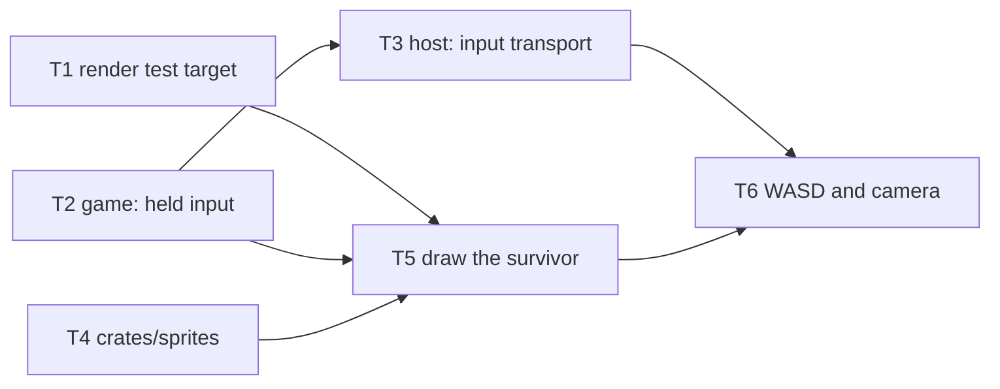

# Design: Survivor WASD Movement

## Context & Problem

Marrowfall runs a deterministic simulation at a fixed 60 Hz and paints its
terrain through a Godot frontend, but nothing is alive in it: no entity is
under player control, no input reaches the simulation, and the survivor sprite
atlases the art pipeline already produced are not loaded by anything.
`docs/concept.md` ("Controls") specifies direct WASD movement rather than click
to move, because the punishing combat it describes depends on precise
positioning. Until a character can be walked around, none of the systems that
follow (collision, combat, stamina) have anything to attach to, and the
boundary protocol staged in `crates/game/src/lib.rs` stays unproven.

## In Scope

- The survivor exists in the starting world and is drawn on his tile.
- Held keyboard input reaches the simulation once per tick, independent of
  frame rate.
- WASD moves him at a constant tile space speed, in the eight directions the
  keys point on screen.
- He plays the correct animation clip and direction row for what he is doing.
- The camera follows him.
- He cannot walk off the placeholder field.

## Out of Scope

- **Discrete actions** (attack, dodge, jump): `Intent` stays uninhabited until
  something needs a reliable one shot message.
- **Mouse aim and decoupled facing:** facing follows movement, so no cursor.
- **The `walk_back` clip:** selectable only once aim and movement are
  decoupled, and `art/animations/library.ron` records it as a broken loop.
- **Collision and blocking terrain:** the field edge is a clamp, not a system,
  and flat ground occludes nothing, so depth interleaving waits for a wall.
- **Analog movement:** a stick would need normalise then rescale, no caller.
- **Camera limits, deadzone, lead and shake:** the field is a diamond, which a
  rectangular limit cannot express, and nothing needs the camera to lag.
- **Per entity appearance:** every entity draws the survivor, because there is
  only one character.
- **Authored data under `data/`:** the one tuning number here is a constant,
  and a loader plus a path into a simulation that may not do I/O is its own
  milestone.
- **Gamepad and a remapping UI:** Godot's own InputMap already remaps.

## Terminology

- **Held input:** state that is true while a key is down, such as a movement
  direction. A discrete action is true for one instant instead.
- **Tile space:** the simulation's coordinates, `1.0` = one tile edge. The
  simulation knows only this; only `crates/render` knows screen pixels.
- **Field:** the placeholder 24 by 24 tile walkable area, standing in for real
  worldgen.
- **Locomotion:** what a character is doing, `Idle` or `Running`. Simulation
  state the snapshot carries; the clip filename it maps to is not.
- **Clip and row:** one animation of a character (`idle`, `run`) packed as one
  atlas, and the frames of it for one of the eight directions.
- **Cell and anchor:** the untrimmed box a clip's frames sit inside, and the
  pixel in it that sits on the entity's tile, the feet.

## Key Decisions

### How does held input reach the simulation?

The two clocks never match, and whatever crosses must already be in tile
space, because `snapshot.rs:10-12` forbids screen space at the boundary.

#### ✅ Option 1: A latest wins triple buffer carrying a tile space direction

```rust
handle.set_input(Input::new(iso::screen_dir_to_tile(held))); // per frame
sim.tick(*inputs.read(), &[]);                               // per tick
```

**Pros:**
- Speed depends on tick count, never on frame rate.
- Dropping stale samples is right for state that is only "true now".
- Wait free on both sides, and `triple_buffer` is already a dependency.
- The isometric inverse stays in `render`, so no pixels reach the simulation.

**Cons:**
- A third transport for `host` to own, and wrong for discrete actions.

**Rationale:**
- Already written into `lib.rs:22-31`, and the reason is arithmetic: one
  reliable message per frame delivers 2.4 per tick at 144 fps and half of one
  at 30 fps, so speed would track the display.
- Converting inside the simulation instead would put tile pixel size and the
  projection into the crate whose whole point is having no pixels.

#### ❌ Option 2: Held input as reliable `Intent`s on the command channel

```rust
commands.send(SimCommand::Intent(Intent::Move(direction))); // every frame
```

**Pros:** one transport instead of two, and the channel already exists.

**Cons:**
- A variable number of moves per tick, so distance tracks frame rate.
- Nothing is dropped, so a stall grows the queue without bound.

**Rationale:** Rejected. It makes speed depend on the display, the one thing a
fixed timestep exists to prevent.

### How does the simulation know which entity input drives?

#### ✅ Option 1: A `Player` marker component, requested at spawn

```rust
Spawn { at: centre, velocity: Some(Vec2::ZERO), player: true }
for (_, v) in self.world.query_mut::<(&Player, &mut Velocity)>() { .. }
```

**Pros:**
- The world stays the single source of truth, with no id to go stale.
- Additive, and named fields keep the call site readable.
- Extends to a possessed entity or a second local player unchanged.

**Cons:** every existing `Spawn` literal gains `player: false`.

**Rationale:**
- The blast radius is four test literals, and a marker cannot fall out of sync
  with the entity it marks.
- The snapshot still names the controlled id, because the camera needs a
  target and only the simulation knows which entity that is.

#### ❌ Option 2: An id stored on `Sim`, or passed in by the frontend

```rust
struct Sim { world: hecs::World, player: Option<hecs::Entity>, .. }
```

**Pros:** one direct lookup, no query, and no change to `Spawn`.

**Cons:**
- Stores world state outside the world, so despawn must clear it.
- Letting the frontend send an id means any id it sends is obeyed.

**Rationale:** Rejected. On `Sim` it is the same fact stored twice; in the
frontend it is an authority decision made outside the simulation.

### What stops the survivor walking off the field?

The camera follows, so leaving the field no longer loses the character. It
fills the view with unpainted void instead.

#### ✅ Option 1: Clamp the player's position, after integration

```rust
let far = Vec2::new((self.terrain.width() - 1) as f32,
                    (self.terrain.height() - 1) as f32);
position.current = position.current.clamp(Vec2::ZERO, far); // on &Player
```

**Pros:**
- Keeps him on painted ground, so void stays at the edge of the view.
- Slides along an edge rather than sticking: only the blocked axis stops.
- Shortens a move instead of jumping, so `Position::previous` stays correct.

**Cons:**
- A movement rule that real collision will replace.
- It is a wall, so intent and motion diverge. See the locomotion decision.

**Rationale:**
- Read from `terrain.width()` and `height()` rather than the private
  `WORLD_SIZE` (`sim.rs:21`), so it survives the first non square zone, is
  reachable from a test, and needs no change of visibility.
- Player only: the player is the only thing that can be driven off the field,
  and clamping every entity would break the existing integration tests, whose
  `DRIFT` and `ALONG_Y` velocities (`test_sim.rs:7-12`) deliberately leave it.

#### ❌ Option 2: Let him walk into the void

```rust
// no clamp system at all
```

**Pros:** no new system, and honest about there being no collision yet.

**Cons:** the camera follows him into unpainted space, so the screen empties.

**Rationale:** Rejected. It makes the feature hard to verify by playing it.

### Who owns the sprite manifest types?

`CharacterAssets` and friends live in `crates/xtask-art/src/pack.rs`, and the
game must read the same `.ron` at runtime.

#### ✅ Option 1: A new `crates/sprites` crate that owns and validates the format

```rust
pub fn parse(text: &str) -> Result<CharacterAssets, Error>; // syntax + rules
```

**Pros:**
- One definition, so the compiler catches writer and reader drift.
- Validating at the edge makes `frame_at` and `frame` total, with no panic and
  no `Option` for callers to handle.
- No engine and no game logic, so every line is unit testable.
- Keeps `reqwest`, `tokio`, `clap` and `image` out of the shipped library.

**Cons:** a fifth crate, and `serde` plus `ron` link into the shipped cdylib.

**Rationale:**
- The manifest is a contract between two programs, and a contract with two
  definitions is a bug waiting for the next pipeline change.
- Validation is what earns the crate. A one line wrapper over `ron::from_str`
  would not, because it could only ever report syntax.

#### ❌ Option 2: Keep the types where they are, or move them into `game`

Three variants: `render` depends on `xtask-art`; `xtask-art` feature gates its
heavy dependencies so `render` can depend on it with `default-features =
false`; or the types move into `crates/game`.

```toml
xtask-art = { path = "../xtask-art", default-features = false }
```

**Pros:** no new crate, and the feature gate moves no code at all.

**Cons:**
- A plain dependency links the whole art pipeline into the game, and the
  feature gate makes the shipped dependency set a property of a CLI tool's
  default features, easy to break silently and hard to test.
- Putting atlas layout in `game` puts a render concern, plus `serde` and `ron`,
  into the simulation crate, which will never read a pixel rectangle.

**Rationale:** Rejected. Copying the types instead is worse again: two
definitions of one format kept in step by hope.

### Which Godot node draws the survivor?

Frames are trimmed to their own content, so each carries an offset inside a
shared cell, and the anchor is measured in that cell.

#### ✅ Option 1: One `Sprite2D` per entity, region and offset set per frame

```rust
sprite.set_centered(false);        // plus region_enabled and
sprite.set_region_rect(p.region);  // region_filter_clip_enabled, once
sprite.set_offset(p.offset);       // frame offset minus anchor
```

**Pros:**
- Clip, row, frame, region, offset and node lifecycle are pure functions over
  plain data, so all of it is unit testable with no engine.
- The frame index is a function of time, so turning cannot reset the cycle.
- No runtime resource graph: two textures, three property writes.
- Trimming needs nothing extra: the offset says where the pixels sat.

**Cons:** frame advance is ours, which is one modulo.

**Rationale:**
- `region_filter_clip_enabled` is Godot's own answer to atlas bleeding.
- `centered = false` with `offset` puts the node origin on the feet, which
  makes the transform point and the y sort key the same point.

#### ❌ Option 2: `AnimatedSprite2D` with a runtime built `SpriteFrames`

```rust
frames.add_frame("run_se", &atlas_texture); // x8 directions x20 frames
```

**Pros:** the engine owns looping and timing, and it is the familiar approach.

**Cons:**
- Around 280 `AtlasTexture` resources built at startup, for one character.
- Each direction is its own animation, so turning restarts the cycle unless
  frame and progress are copied across by hand every time.
- Timing follows the engine's frame delta, so it drifts from the world, and
  trimmed frames still need `AtlasTexture.margin` padded out per frame.

**Rationale:** Rejected. The built in saves one modulo and costs a resource
graph, a turning bug to work around, and a second clock.

### Where does the idle versus run choice come from?

#### ✅ Option 1: The simulation publishes it, derived from `Velocity`

```rust
pub enum Locomotion { Idle, Running }
// snapshot(): Running when the entity has a non zero Velocity, else Idle.
```

**Pros:**
- Correct at the clamp: intent survives when motion is zero, so a held key
  never shows idle.
- Follows the precedent `components.rs:43-44` sets for `Facing`: character
  state belongs to the simulation, not to whoever draws it.
- Derived inside `snapshot` from `Velocity`, so there is no second copy of the
  truth to disagree with it, and no new system or tick order change.

**Cons:** a new `EntityView` field whose only reader today is a frontend.

**Rationale:**
- The clamp is a wall, and the four screen cardinals (W, A, S and D) each
  drive straight at a field corner where both tile axes clamp, so a held key
  produces exactly zero motion there.
- `snapshot.rs:10-12` lets a view describe its own data and forbids it
  deciding how a frontend draws. "Is this entity running" is the first, "which
  PNG" is the second and stays in `render`.
- Two variants only. Dodge, stagger and airborne extend the enum later, and
  the first state not derivable from `Velocity` turns it into a component.

#### ❌ Option 2: The frontend derives it from the motion in the snapshot

```rust
let clip = if view.pos != view.prev_pos { Clip::Run } else { Clip::Idle };
```

**Pros:** no boundary change, and clip choice is arguably render policy.

**Cons:**
- Shows idle while a key is held, at any of the four field corners.
- Every later blocker (a wall, a shove, a grab) reproduces the same bug.

**Rationale:** Rejected. It reads the consequence of movement rather than the
state, so anything that stops movement without stopping intent breaks it.

### What clock advances the animation?

#### ✅ Option 1: Simulation time, walked back to the instant actually drawn

```rust
// snapshot.time stamps `pos`; lerp(0) draws `prev_pos`, one tick earlier.
let seconds = snapshot.time - (1.0 - f64::from(alpha)) * TICK_DT;
```

**Pros:**
- No per node state, so a node created mid clip is already in phase.
- Every direction of a clip shares one phase, so turning cannot reset it.
- Times the instant actually drawn, so the clip cannot lead the sprite.

**Cons:** entities of a kind are in lockstep, wrong for a crowd. One exists.

**Rationale:**
- `sim.rs:85` computes `time` as `ticks * TICK_DT` and `sim.rs:125` increments
  `ticks` at the end of the tick, so `snapshot.time` stamps `pos` while
  `EntityView::lerp(0)` returns `prev_pos`. Without the subtraction the clip
  runs 16.7 ms ahead of the sprite forever.
- `frame_at` clamps negative seconds to zero, absorbing the tick 0 seed
  snapshot published before any tick has run.

#### ❌ Option 2: Accumulate the frame delta per node

```rust
self.elapsed += delta; // per sprite, reset on every clip change
```

**Pros:** independent phase per entity for free.

**Cons:**
- Per node state to create, reset and keep in step with clip changes.
- Animation drifts against the world when the simulation stalls.

**Rationale:** Rejected. Phase variation matters at the first crowd, and it
can be a per entity offset on the shared clock rather than a second clock.

### How do entities and terrain sort?

#### ✅ Option 1: A y sorted `Entities` node, listed after `Ground`

```text
Main (Node2D, y sort off)
  Ground (TileMapLayer, y sort off), Entities (Node2D, y sort on),
  Camera2D, Bridge
```

**Pros:**
- Correct today: flat ground occludes nothing, and siblings of an unsorted
  parent draw in tree order, so entities land on top.
- Correct at the second entity with no code, because feet are the node origin
  and screen depth is exactly the y they sort on.
- No tileset authoring, so nothing has to be edited to make it work.

**Cons:** no interleaving, so a future wall draws under a character behind it.

**Rationale:**
- The wall case is an established pattern rather than a trap: Godot's official
  `2d/isometric` demo y sorts a `Node2D` and the `TileMapLayer` inside it,
  with `y_sort_origin = 32`. It needs a per tile origin authored in the
  tileset, which has no consumer until a wall exists.
- `z_index` stays 0 everywhere. It is not ignored inside a y sorted parent, it
  overrides the sort: items are y sorted and then bucketed by `z_index`, and
  the buckets draw in z order, so a stray `z_index` silently defeats sorting.

#### ❌ Option 2: Y sort `Main` and `Ground` now

```text
Main (y sort on) -> Ground (TileMapLayer, y sort on)
```

**Pros:** prepares for walls in advance.

**Cons:**
- Needs `y_sort_origin` per tile in the tileset, authoring work with nothing
  to show for it.
- Cannot be validated, because nothing occludes anything yet.

**Rationale:** Rejected. Untestable preparation for a feature that is out of
scope.

### How does the camera follow an interpolated target?

`EntityView::lerp(alpha)` already smooths the survivor, so anything that
smooths a second time turns his motion into camera motion.

#### ✅ Option 1: A sibling `Camera2D`, positioned every `_process` from that lerp

```rust
self.camera.set_global_position(iso::tile_to_screen(drawn));
```

**Pros:**
- Pins the camera to his drawn position, so he is rock steady and every
  residual error lands on the terrain, the cheapest place to put it.
- Survives the survivor's node being freed, which reconciliation can do at any
  snapshot, and leaves a future deadzone or shake free of a parent transform.

**Cons:** it relies on the transform notification path below, so turning
smoothing on later silently reintroduces a frame of lag.

**Rationale:**
- No lag, and this is load bearing: `SceneTree::process` calls `_process` then
  `flush_transform_notifications` in the same frame
  (`scene/main/scene_tree.cpp:688`), and `Camera2D::_notification` handles
  `NOTIFICATION_TRANSFORM_CHANGED` by updating scroll when smoothing and
  physics interpolation are both off. `_process` is also the documented slot
  for this work: "prior to rendering, and after physics ticks".
- Without that path the lag is real: `Camera2D` is index 1 in `main.tscn` and
  `Bridge` index 2, and order inside a process group is `process_priority`
  then tree order (`Node::ComparatorWithPriority`), so the camera would update
  before the Bridge wrote the target. Fixed in 4.3, cherry picked to 4.2.2, by
  godotengine/godot#84465, closing #74203 and #77813, the latter being exactly
  this shape: a camera trailing its siblings when a lerp moves the target.
- `process_callback` stays `CAMERA2D_PROCESS_IDLE`, the default. The rule from
  Godot's `2d/isometric` demo is to match the callback to wherever the target
  transform is written; that demo chooses physics because its goblin moves in
  `_physics_process`, and this design writes in `_process`.

#### ❌ Option 2: Parent the camera to the survivor's sprite node

```text
Entities -> Sprite2D (survivor) -> Camera2D
```

**Pros:** no per frame code, and it is what Godot's own 2D demos do, including
the isometric one under physics interpolation.

**Cons:**
- `bridge.rs` frees any node whose id is absent from a snapshot, so the camera
  dies with the survivor.
- A deadzone, lead or shake would then have to fight the parent transform.

**Rationale:** Rejected on lifecycle alone, not on rendering. Parenting is
correct where the followed node is authored and permanent; here the node is
created and freed from snapshots.

#### ❌ Option 3: Godot's `position_smoothing_enabled`

```rust
self.camera.set_position_smoothing_enabled(true); // plus a speed
```

**Pros:** one property instead of a per frame write.

**Cons:**
- Enabling it opts back out of the same frame path #84465 added, because that
  fix is conditional on smoothing being off.
- The engine carries a `FIXME` verbatim from 4.3 to master saying smoothing
  "may be called MULTIPLE TIMES on certain frames ... which will result in
  some haphazard results", and `position_smoothing_speed * delta` is not
  clamped to 1.0, so a frame spike overshoots. (Its docs call that speed
  pixels per second; it is a raw lerp factor, which open PR #117637 corrects.)

**Rationale:** Rejected. Conceptually wrong as well as buggy: the target is
already interpolated, so camera lag would convert the survivor's motion into
camera motion.

## Architecture Overview

```text
 main thread (crates/render)          sim thread (crates/host + game)
 InputMap move_* -> get_vector -> iso::screen_dir_to_tile -> Input::new
   -> SimHandle::set_input ===> Output<Input>::read   (triple buffer, in)
                               Sim::tick(input, &[]): carry, apply_input,
                               apply_velocity, keep_player_on_the_field,
                               apply_facing
   Frame { snapshot, alpha } <=== Published { snapshot, due_at }   (out)
   -> sprite::reconcile creates and frees Sprite2D nodes; sprites::row_for
      and frame_at, sprite::placement and iso::tile_to_screen drive each
   -> one Sprite2D per entity under the y sorted Entities node, plus a
      sibling Camera2D pinned to the controlled entity's drawn position
```

Every arrow across the boundary carries plain copyable data.

## Third Party Dependencies

No new third party crate enters the workspace; both format crates below are
already pinned in the root `Cargo.toml`.

| Capability | Chosen | Alternatives considered | Why |
| --- | --- | --- | --- |
| Held input across threads | `triple_buffer` 9.0 | `std::sync::Mutex`, `arc-swap`, `crossbeam-channel` | Wait free on both sides and latest wins by construction, already used for snapshots. A lock can make the tick loop wait on the renderer; a channel queues what should be dropped; a packed atomic means hand packing two floats. |
| Manifest format | `ron` 0.12 with `serde` 1.0 | JSON, TOML, Godot `.tres` | The pipeline already writes RON and the file is committed. A second format means two writers. |
| Sprite animation | Godot `Sprite2D` region | Godot `AnimatedSprite2D` with `SpriteFrames`, `AnimationPlayer` | See the node decision: the built ins cost a runtime resource graph, a second clock, and a turn resets the cycle. |
| Camera follow | explicit per frame write | `Camera2D` position smoothing, physics interpolation, parenting | See the camera decision: the target is already interpolated, and both engine smoothers are the wrong clock. |
| Input mapping | Godot InputMap actions | Reading physical keycodes directly in Rust | Actions are remappable, visible in the editor, and `get_vector` already applies a deadzone and clamps to length 1, which a gamepad will need. |
| Engine dependent tests | none | `gd-rehearse` | Everything new is pure logic, testable with plain `cargo test`. A harness for tests we do not write is dead weight. |

## Structure

```text
Cargo.toml               + sprites in members and [workspace.dependencies]
game/src/lib.rs          + Input, beside the existing Intent
game/src/components.rs   + Player marker; Facing::name() -> "s" | "se" | ..
game/src/sim.rs          + PLAYER_SPEED, Spawn::player, apply_input,
                           keep_player_on_the_field; Sim::new spawns him
game/src/snapshot.rs     + Locomotion, EntityView::locomotion,
                           RenderSnapshot::player
game/tests/unit/         test_input.rs NEW; test_sim.rs, test_snapshot.rs
host/src/lib.rs          + inbound Input triple buffer, SimHandle::set_input
sprites/            NEW  serde, ron. src/lib.rs: Anchor, FrameRect,
                         AnimationAtlas, CharacterAssets, Error, parse,
                         row_for, frame_at, frame. tests/unit/mod.rs and
                         test_sprites.rs, plus [[test]] name = "unit"
xtask-art/src/pack.rs    re-exports the four types from `sprites`
render/Cargo.toml        + sprites; [[test]] name = "unit", same path
render/src/lib.rs        + pub mod iso; pub mod sprite; (pub, or the separate
                           test crate cannot see them)
render/src/iso.rs   NEW  TILE_WIDTH, TILE_HEIGHT, tile_to_screen,
                         screen_dir_to_tile
render/src/sprite.rs NEW Clip, Placement, placement, Changes, reconcile
render/src/bridge.rs     + entities: OnReady<Gd<Node2D>>, focused: bool,
                           sprites: HashMap<u64, Gd<Sprite2D>>, textures:
                           HashMap<Clip, Gd<Texture2D>>, assets: Option<..>
render/tests/unit/       mod.rs, test_iso.rs, test_sprite.rs NEW
project/project.godot    + [input] with four actions
project/scenes/main.tscn + Entities (Node2D, y_sort_enabled); zoom 1.0
```

Paths are relative to `crates/` except the `project/` ones. Cargo does not
discover `tests/unit/mod.rs` on its own, so both new test targets need the
`[[test]]` stanza `crates/game/Cargo.toml:16-18` already carries, and the
coverage script runs `--lib --test unit`. `bridge.rs` stays the only file
touching `Gd<T>`, which keeps everything else measured.

## Specs & Standards

- **RON grammar** (canonical EBNF in `ron-rs/ron`, `docs/grammar.md`): governs
  `project/assets/characters/<name>/character.ron`, read with `ron::from_str`
  into `serde` derived types, encoded as UTF-8 (RFC 3629) because
  `FileAccess::get_file_as_string` interprets it that way.
  <https://github.com/ron-rs/ron/blob/master/docs/grammar.md>
- **IEEE 754-2019, clause 5.4.1:** addition, subtraction, multiplication,
  division and `squareRoot` are correctly rounded, which is why normalising an
  input vector in `f32` replays bit identically. glam's `Vec2` is scalar, so
  no SIMD path can vary the result.
- **Godot `Sprite2D`:** `region_enabled`, `region_rect`,
  `region_filter_clip_enabled` ("the area outside of `region_rect` is clipped
  to avoid bleeding of the surrounding texture pixels"), `centered`, and
  `offset` (larger `offset.y` moves down, so screen `+y` is down).
  <https://docs.godotengine.org/en/stable/classes/class_sprite2d.html>
- **Godot `CanvasItem`:** `y_sort_enabled` draws children in y order, and
  nodes "sort relative to each other only if they are on the same `z_index`".
  <https://docs.godotengine.org/en/stable/classes/class_canvasitem.html>
- **Godot `InputEventKey.physical_keycode`:** the physical location of a key
  on a US QWERTY layout, recommended for game input such as WASD, so the keys
  stay in the same place on AZERTY. `Input.get_vector` reads four such actions
  as one axis pair, deadzone applied and length clamped to 1.
  <https://docs.godotengine.org/en/stable/classes/class_inputeventkey.html>
- **gdext unit tests:** the godot-rust book states `cargo test` is for Rust
  only logic because the engine is unavailable to the test binary, which is
  the constraint `iso.rs` and `sprite.rs` are written to satisfy.
  <https://godot-rust.github.io/book/contribute/dev-tools.html>

## Interfaces

### `crates/game`

```rust
pub struct Input { move_dir: Vec2 }   // private: cannot be built out of range
impl Input {
    /// Not finite becomes still, longer than unit length is scaled back. A
    /// trust boundary against a malformed frontend, not input shaping.
    pub fn new(move_dir: Vec2) -> Self;
    pub fn move_dir(self) -> Vec2;
}
pub const PLAYER_SPEED: f32 = 4.0;    // tile units/s, a playtest start point
pub enum Locomotion { Idle, Running } // extended by dodge, stagger, airborne
pub struct Spawn { pub at: Vec2, pub velocity: Option<Vec2>, pub player: bool }
pub struct EntityView { /* .. */ pub locomotion: Locomotion }
pub struct RenderSnapshot { /* .. */ pub player: Option<u64> }
impl Facing { pub fn name(self) -> &'static str; }  // "s", "se", "e", ..
impl Sim {
    pub fn new(seed: u64) -> Self;    // terrain plus the survivor, centred
    pub fn tick(&mut self, input: Input, intents: &[Intent]);
}
```

Caller contract: `spawn` asserts that a `player: true` spawn carries a
velocity, since nothing could otherwise move it. `tick` reads `input` once, so
skipping ticks loses no held state. `RenderSnapshot::player` lets a frontend
aim a camera without guessing which entity is controlled.

### `crates/host`

```rust
/// Replaces the held input the next tick will read. Safe to call any number
/// of times per frame, including zero, in which case the previous value
/// stands and the player keeps walking.
pub fn set_input(&mut self, input: Input);  // on SimHandle
```

Callers must stop sampling on focus loss, and call this before `read`, which
borrows the handle.

### `crates/sprites`

`Anchor`, `FrameRect`, `AnimationAtlas` and `CharacterAssets` move across
unchanged, field for field, so no manifest or atlas file changes. The wire
contract is the RON field names plus the `rects` index order,
`direction * frames + frame`.

```rust
pub enum Error {
    Syntax(ron::error::SpannedError),
    Invalid { animation: String, detail: &'static str },
}
/// Parses and validates: `frames > 0`, `fps > 0`, `directions` non empty,
/// `rects.len() == directions.len() * frames`, anchor inside the cell.
/// Everything below is then total, with no panic path.
pub fn parse(text: &str) -> Result<CharacterAssets, Error>;
/// `None` if this atlas has no such row, which is how a four direction atlas
/// answers "se"; the caller then leaves the sprite on the frame it had.
pub fn row_for(atlas: &AnimationAtlas, direction: &str) -> Option<usize>;
/// Negative seconds clamp to zero. Wraps when the clip loops, holds the last
/// frame when it does not.
pub fn frame_at(atlas: &AnimationAtlas, seconds: f64) -> usize;
pub fn frame(atlas: &AnimationAtlas, row: usize, frame: usize) -> &FrameRect;
```

### `crates/render`

```rust
// iso.rs: the measured mapping, in one place. `Vec2` is game's re-export
// (lib.rs:18-20), so this crate never picks its own glam.
pub const TILE_WIDTH: f32 = 192.0;
pub const TILE_HEIGHT: f32 = 96.0;
pub fn tile_to_screen(tile: Vec2) -> Vector2;       // to that tile's centre
pub fn screen_dir_to_tile(screen: Vector2) -> Vec2; // a direction, or zero

// sprite.rs: what the frontend chooses, and which nodes exist.
pub enum Clip { Idle, Run }
impl Clip {
    pub const ALL: [Clip; 2];
    pub fn for_locomotion(locomotion: Locomotion) -> Self;
    pub fn name(self) -> &'static str;  // "idle" | "run"
}
pub struct Placement { pub region: Rect2, pub offset: Vector2 }
pub fn placement(atlas: &AnimationAtlas, rect: &FrameRect) -> Placement;

/// Ids needing a node and nodes to free, from one snapshot and the ids
/// already drawn. Absent means despawned (`snapshot.rs:14-15`). Both vectors
/// stay unallocated on a frame where nothing changed.
pub struct Changes { pub added: Vec<u64>, pub removed: Vec<u64> }
pub fn reconcile(views: &[EntityView], drawn: impl IntoIterator<Item = u64>)
    -> Changes;
```

### Godot input actions

Four actions, each bound to one physical keycode, authored through the
editor's Input Map so `project.godot` carries the engine's own serialisation
for 4.7 rather than a hand written blob: `move_up` W, `move_down` S,
`move_left` A, `move_right` D.

## Existing Code & Reuse

- **`Facing::from_direction`** already quantises a tile direction into eight
  equal sectors with comparisons only, and gains `Facing::name()` so the
  compass vocabulary is not copied a third time beside `pack.rs:19` and
  `framing.py:17-20`. The frontend must never re-derive a row from a screen
  angle: the sectors are equal in tile space and unequal on screen.
- **`EntityView::lerp` and `host::alpha_for`** already own interpolation. The
  frontend calls `lerp(alpha)` for both the sprite and the camera target, and
  interpolates nothing itself.
- **`pack.rs` `GUTTER`** already writes a two pixel transparent gutter between
  packed frames, with `process/fix_alpha_border=true` and mipmaps off, which
  the committed atlas confirms: frames at x 464 (w 83), 549 and at 836
  (w 79), 917 sit exactly two pixels apart. The ground layer is covered by
  `TileSetAtlasSource.use_texture_padding`, true by default. So no padding
  logic belongs in `render`; `region_filter_clip_enabled` is belt and braces.
- **`Sim::with_entities`** stays the seam tests use to build a specific cast;
  `Sim::new` gains the survivor rather than a new constructor beside it.
- **`frame_camera` is superseded:** the one shot centring in `ready` goes
  away, replaced by the per frame write in `process`. `paint_ground`,
  `TerrainGrid`, `triple_buffer`, `Position::previous` and `Velocity` are
  reused unchanged, and `DIRECTIONS_8` stays in `xtask-art`.

## Logic

Tick order, with the two new systems slotted in. `apply_input` writes
`input.move_dir() * PLAYER_SPEED` into every `Velocity` carrying a `Player`.

```rust
pub fn tick(&mut self, input: Input, intents: &[Intent]) {
    let _ = intents; // still uninhabited
    self.carry_positions_forward();
    self.apply_input(input);   // before integration, so it lands this tick
    self.apply_velocity();
    self.keep_player_on_the_field(); // shortens a move, so before facing
    self.apply_facing();       // reads the motion actually applied
    self.ticks += 1;
}
```

`Locomotion` is read straight off `Velocity` in `snapshot`, through an
`Option<&Velocity>` in the query, so nothing holds a second copy of it.

Undoing the isometric projection, which is why `W` means up the screen. The
`normalize_or_zero` is what makes movement isotropic and must not be removed:
the inverse is anisotropic by exactly 2x, since `W` maps to magnitude
`sqrt(2)/96` and `D` to `sqrt(2)/192`. `Input::new`'s clamp is a trust
boundary against a malformed frontend, not the thing that evens out diagonals.

```rust
pub fn screen_dir_to_tile(screen: Vector2) -> Vec2 {
    let x = screen.x / TILE_WIDTH;   // screen x in tile widths
    let y = screen.y / TILE_HEIGHT;  // screen y in tile heights
    Vec2::new(x + y, y - x).normalize_or_zero()
}
```

Every key combination, and the row it ends up showing:

| Keys | Screen direction | Tile direction | `Facing` |
| --- | --- | --- | --- |
| W | (0, -1) | (-0.71, -0.71) | North |
| W + D | (0.71, -0.71) | (-0.32, -0.95) | NorthEast |
| D | (1, 0) | (0.71, -0.71) | East |
| S + D | (0.71, 0.71) | (0.95, 0.32) | SouthEast |
| S | (0, 1) | (0.71, 0.71) | South |
| S + A | (-0.71, 0.71) | (0.32, 0.95) | SouthWest |
| A | (-1, 0) | (-0.71, 0.71) | West |
| W + A | (-0.71, -0.71) | (-0.95, -0.32) | NorthWest |

Frame choice is total because `parse` has already checked `frames > 0`. The
placement puts a trimmed frame's anchor on the tile: the cell's top left goes
at minus the anchor, the frame sits at `off_x, off_y` inside that cell, and
`centered = false` makes `offset` the top left.

```rust
let elapsed = (seconds.max(0.0) * f64::from(atlas.fps)) as u64;
let index = if atlas.loops { elapsed % u64::from(atlas.frames) }
            else { elapsed.min(u64::from(atlas.frames - 1)) };
let offset = Vector2::new(rect.off_x as f32 - anchor.x as f32,
                          rect.off_y as f32 - anchor.y as f32);
```

Per frame in `bridge.rs`. `Entities` is an `OnReady<Gd<Node2D>>` field beside
`ground` and `camera`, because `base_mut()` would borrow all of `self` while a
snapshot borrow is alive, whereas `sim.read()` borrows only `self.sim`.
`focused` is a field flipped by `WM_WINDOW_FOCUS_IN` and `_OUT`; gating the
sample is the fix, since writing a default in the handler alone is overwritten
by the same frame's unconditional sampling.

```rust
let held = if self.focused { sample() } else { Vector2::ZERO };
sim.set_input(Input::new(iso::screen_dir_to_tile(held)));
let (seconds, target, views) = { let f = sim.read(); .. }; // copy out first
let changes = sprite::reconcile(&views, self.sprites.keys().copied());
// added: Sprite2D::new_alloc, configure, entities.add_child
// removed: queue_free, then drop from self.sprites
for view in &views { /* texture, region, offset, position */ }
self.camera.set_global_position(iso::tile_to_screen(target));
```

## Edge Cases & Constraints

- **`PLAYER_SPEED` is a starting point, not a derived figure.** No closed form
  exists: `tools/blender/src/framing.py:22-25` bakes at 35 degrees elevation,
  whose own comment says it must match the tile projection and then does not
  (`atan(0.5)` is 26.57), so sprite height is foreshortened while ground
  travel across the screen is not, and pixels of height cannot be divided by
  pixels of tile width. The committed data shows the confound: the same 1.7 m
  survivor has `cell_height: 240` for `idle` and `260` for `run`. Expect
  roughly 8 to 15 percent foot slide, and tune 4.0 by eye against `run`.
- **96 percent line coverage** excludes only `render/src/bridge.rs` and
  `xtask-art/src/main.rs`, so `iso.rs`, `sprite.rs` and all of
  `crates/sprites` must be testable with no engine. They touch no `Gd<T>`, and
  gdext's `Vector2` and `Rect2` are plain `#[repr(C)]` Rust structs.
- **A `crates/render` test target is unproven.** CI runs `cargo nextest run`
  over the workspace on `ubuntu-24.04-arm` (`.github/workflows/rust.yml:76`)
  with no Godot installed, so a gdext linked test binary there is exactly the
  risk. T1 proves it before anything depends on it. If it fails, the pure
  functions move into a new engine free crate that may depend on `game`, which
  `xtask-art` does not depend on, so nothing leaks into the pipeline. They
  cannot move into `crates/sprites`, because `reconcile` needs `EntityView`.
- **Screen speed is direction dependent,** correctly, for a world space
  simulation: at 4.0 tiles per second East and West travel 543 px/s, the
  screen diagonals 343, North and South 271.5, a 2:1 spread.
- **Edge sliding changes the facing.** Holding A at `x = 0` yields SouthWest,
  not West, and holding W and D at `y = 0` yields NorthWest even though the
  player asked for up and right. The residual is the honest travel direction.
- **Stuck keys on focus loss** are real: the OS does not always deliver the
  key release (godotengine/godot#18785, with #108745 on macOS and #82732 on
  web), so the `focused` gate is required rather than optional.
- **`zoom` becomes `Vector2(1.0, 1.0)`:** one atlas texel per base viewport
  pixel, so neither minification aliasing nor magnification blur. The survivor
  goes from 6.7 to 16.7 percent of screen height and the camera gains 2048 by
  864 px of travel. Under `canvas_items` stretch the visible size is always
  the 2560 by 1440 base whatever the window size, so this is stable. Do not
  chase integer zoom: the effective texel to device scale is
  `zoom * (window_width / 2560)`, so integer zoom is an integer scale only at
  exactly 1440p, and this project already opted out of pixel perfect
  rendering, which is right for baked 3D art. Do not enable
  `snap_2d_transforms_to_pixel` either: it snaps item transforms and y sort
  keys but not the canvas transform the camera writes, giving quantised
  sprites sliding against a smooth background and y sort order flipping at
  near equal depth (godotengine/godot#71074).
- **Void at the field edge is expected, not a bug.** The field's screen
  bounding box is x in [-2208, 2400] and y in [0, 2304], with the diamond tips
  at the box's edge midpoints, so the box corners are pure void. `Camera2D`
  limits are rectangular and cannot express a diamond: set to that box they
  would still show up to 38.8 percent void at a corner while jamming the
  player 48 px from the top edge at tile (0, 0), and void free framing needs
  zoom of at least 1.181. Treat it as a background and vignette problem. A
  later clamp belongs in Rust in tile space, against `0 <= x + y <= 46` and
  `0 <= x - y <= 46`, which reuses `x + y`, already the depth sort key.
- **Leave physics interpolation and `physics_interpolation_mode` alone.** Both
  are off by default. Setting the mode explicitly on a `Camera2D` spams
  `Parameter "data.tree" is null` (godotengine/godot#97957), enabling
  interpolation at runtime can stop the camera scrolling (#101195), and
  `Camera2D` would then drive from
  `Engine::get_physics_interpolation_fraction`, a fraction of Godot's physics
  tick with no relationship to `host`'s `alpha`: two interpolators disagreeing
  every frame. The engine's warning about that override sits inside
  `#ifdef TOOLS_ENABLED`, so a shipped build is silent about it.
- **Do not enable mipmaps to fix shimmer.** `pack.rs:272` states its own
  precondition, "Two pixels is enough with mipmaps off", and `GUTTER = 2`: at
  mip level 1 the gutter is one texel and at level 2 half of one, so mipmaps
  would blend neighbouring animation frames. Zoom 1.0 removes the
  minification that motivated them. If shimmer still shows, raise `GUTTER` and
  re-run the free, deterministic pack stage first; a gutter surviving mip
  level 3 needs roughly 16 px and real atlas area.
- **`Gd<T>` is `!Send` and `!Sync`,** with off main thread access documented as
  undefined behaviour in release, the compiler enforced backstop behind the
  README's threading claim.
- **Replay logs ticks, not frames,** because latest wins means what the
  frontend wrote is not necessarily what the simulation read.
- **A missing or invalid manifest or texture** logs one `godot_error!` and
  draws nothing, matching how a dead simulation thread is already reported.
  The simulation keeps running. BC7 blocks are 4 by 4 and frame rects are not
  aligned to them, so a block can span two frames across the gutter; that
  already ships unnoticed.

## Test Plan

All headless, through the existing nextest and coverage commands.

**`crates/game`**
- `Input::new` clamps a longer than unit vector to unit length and zeroes a
  non finite one.
- Holding a cardinal tile direction for one second moves the player
  `PLAYER_SPEED` tiles, a unit diagonal moves exactly as far, and an entity
  without `Player` ignores input entirely.
- Zero input stops the player and leaves his facing where it was, the case
  `test_sim.rs` currently records as untestable.
- The player stops at each field edge; holding into a corner leaves the facing
  unchanged because no motion happened, while `locomotion` stays `Running`,
  which is the whole reason the snapshot publishes it. Holding into an edge
  diagonally still slides him along it.
- `Facing::from_direction` returns the expected variant for the eight screen
  diagonals in the Logic table, not just the sector centres in `FACINGS`
  (`test_sim.rs:217-226`). Those four are the near boundary cases: short to
  long ratio exactly 1/3 against `SECTOR_EDGE` 0.414214, a 4.07 degree margin,
  and that margin is the fact being pinned. `Facing::name()` returns the eight
  manifest direction names.
- The same seed and input sequence produce an identical snapshot twice, and
  `Sim::new` yields exactly one entity at the middle of the field, which
  `RenderSnapshot::player` names.
- Existing tests to change: `snapshot_of_empty_world_has_no_entities`
  (`test_sim.rs:94-99`) must build its world with `with_entities`, since
  `Sim::new` is no longer empty; four `Spawn` literals gain `player`
  (`test_sim.rs:22, 56, 199, 285`); the `Sim::new` doc at `sim.rs:41` is now
  false. Coverage: `cargo llvm-cov --package game --lib --test unit
  --fail-under-lines 100` keeps this crate where it is.

**`crates/host`**
- Setting an input then polling until the position changes shows the player
  advancing, and never setting one leaves him still. Both poll to a deadline
  in the shape of `test_host.rs:38-56` rather than sleeping a fixed time.
- One input written once keeps moving him across several ticks, the property
  that makes latest wins correct for held state.
- The existing `alpha_for`, liveness and shutdown tests are unchanged.

**`crates/sprites`**
- `parse` round trips a hand written manifest and rejects malformed RON.
- `parse` rejects each invariant separately: zero frames, zero fps, empty
  directions, a mismatched `rects` length, an anchor outside the cell.
- `parse` of the committed `project/assets/characters/survivor/character.ron`
  yields three animations with the expected frame counts, fps, cell sizes and
  anchors. This is the contract test between the pipeline and the game.
- `frame_at` is frame 0 at time 0 and at negative time, wraps at the clip
  length when `loops`, and holds the last frame when it does not. `row_for`
  answers all eight directions and returns `None` for one the atlas lacks.
  Both non default branches use a synthetic atlas, because all three shipped
  clips loop and the survivor is eight direction.

**`crates/render`**
- `tile_to_screen` pins the measured mapping: the origin and one step along
  each tile axis. `screen_dir_to_tile` returns the exact tile direction in the
  Logic table for all eight key combinations, and zero for no keys held.
- `Clip::for_locomotion` maps `Idle` and `Running` to the two clip names, and
  `placement` returns the manifest's rect as the region and the frame offset
  minus the anchor as the offset.
- `reconcile` reports a new id as added, a vanished id as removed, an
  unchanged set as neither, and a reused id as both, the id reuse case
  `snapshot.rs` relies on hecs generations for. And `project.godot` contains
  all four action names, so a lost binding fails a test, not the game.

**By playing the game,** the only way to reach `bridge.rs`: the survivor
stands at the middle of the field with his feet on his tile, idle looping,
drawn over the ground; each of the eight key combinations shows the matching
row and moves him the way the key points on screen; the camera holds him
steady with no judder or lag while the terrain moves under him; no
neighbouring frame bleeds in at the sprite edges; he stops at every edge with
void visible beyond it, which is expected; releasing all keys returns him to
idle facing the way he was going; and alt tabbing while holding a key does not
leave him walking.

Deliberately untested, per Out of Scope: `walk_back`, occlusion against
terrain, discrete actions, camera limits and smoothing, and any second
character.

## Documentation Changes

Each change ships in the task that makes it true, so there is no documentation
only pull request.

- **`README.md`:** add `crates/sprites` to the layout table; change the
  architecture bullet describing two boundary transports to three, naming the
  input buffer; add a line under "Build & run" saying WASD moves the survivor.
- **`crates/render/src/bridge.rs` module doc:** three corrections. Atlas bleed
  is settled (the pack gutter, `use_texture_padding` on the tileset, and
  `region_filter_clip_enabled`). Terrain sorting is settled (Ground unsorted,
  `Entities` a y sorted sibling after it; interleaving waits for a wall). And
  the `z_index` claim is inverted: it is not ignored inside a y sorted parent,
  it overrides the sort, which is why it must stay 0.
- **`crates/game/src/components.rs`:** the rule at lines 13 to 15 says
  anything assigning `current` outside integration must assign `previous` to
  match. Note the distinction the clamp relies on: a shortened move leaves
  `previous` alone, while a jump must carry it.
- **`crates/game/src/lib.rs`:** the `Intent` doc comment describes a split
  that has now landed. Point at `Input` for held state and keep `Intent`
  reserved for discrete actions. **`crates/host/src/lib.rs`** says "the two
  transports"; there are three. And **`pack.rs`**: the manifest types now live
  in `crates/sprites` because the game reads the same file.

## Development Environment Changes

None. No new tool, no new environment variable, no `Brewfile` change: `serde`
and `ron` are already pinned, the `api-4-7` pin is correct against current
stable, and `crates/sprites` joins `members`.

## Tasks



T1, T2 and T4 start in parallel. T1 is first and trivial on purpose, because
everything in `render` depends on its answer.

| #   | Task Name | Task Description | Success Criteria | Dependencies |
| --- | --------- | ---------------- | ---------------- | ------------ |
| T1  | Prove a `render` test target runs | Add `[[test]] name = "unit"` to `crates/render/Cargo.toml`, `tests/unit/mod.rs`, and one assertion on a `Vector2` field. Nothing else. | `cargo nextest run --package render` passes locally and in CI on a host with no Godot installed; the coverage gate still passes. | none |
| T2  | Held input drives the player | Add `game::Input` beside `Intent`, the `Player` marker, `Facing::name`, `Spawn::player`, `PLAYER_SPEED`, `apply_input`, `keep_player_on_the_field`, `Locomotion` with `EntityView::locomotion` and `RenderSnapshot::player`, and make `Sim::new` spawn the survivor at the field centre. Change `tick` to take the input and update `host`'s single call site to pass a default. Fix the named existing tests and the `sim.rs` doc. | Every `crates/game` test in the Test Plan passes, including the eight screen diagonals; the per package coverage command in the Test Plan reports 100 percent for `game`; clippy is clean. | none |
| T3  | Input reaches the simulation | Add an inbound `Input` triple buffer to `crates/host` with `SimHandle::set_input`, read once per tick inside the catch up loop. Alias the `triple_buffer` writer on import so `game::Input` keeps its name. Update the module doc to say three transports. | The `crates/host` tests in the Test Plan pass, polling to a deadline; shutdown and alpha tests still pass. | T2 |
| T4  | Sprite manifest crate | Create `crates/sprites` with the four serde types moved out of `pack.rs`, plus `Error`, `parse` with every invariant, `row_for`, `frame_at` and `frame`. Wire the `[[test]]` stanza and the workspace dependency, point `xtask-art` at it, and add the README row. | The `crates/sprites` tests pass, including every rejected invariant and the committed survivor manifest; `cargo art check` and all existing `xtask-art` tests still pass; no atlas or manifest file changes. | none |
| T5  | The survivor is drawn and animates | Add the y sorted `Entities` node and zoom 1.0 to `main.tscn`, `iso.rs` and `sprite.rs` with their tests, and the per entity `Sprite2D` lifecycle in `bridge.rs`: load the manifest through `FileAccess`, load one texture per `Clip`, and create, update and free nodes through `reconcile`. Correct the `bridge.rs` and `components.rs` docs. | The `crates/render` unit tests pass in CI; running the game shows the survivor at the field centre, feet on his tile, idle looping, drawn over the ground with no edge bleed; the coverage gate passes with no new exclusions. | T1, T2, T4 |
| T6  | WASD moves him and the camera follows | Add the four input actions to `project.godot` bound to physical keycodes, sample them in `process` behind the `focused` gate, convert and hand them to `set_input`. Replace `frame_camera`'s one shot centring with a per frame `set_global_position` on the existing `camera` field, from the controlled entity's `lerp(alpha)`. | Each of the eight key combinations moves him the way it points on screen and shows the matching row; diagonals are not faster; he stops at every edge; the camera keeps him at the same screen point every frame at both 60 and 144 fps; releasing the keys returns him to idle; alt tabbing does not leave him walking. | T3, T5 |
