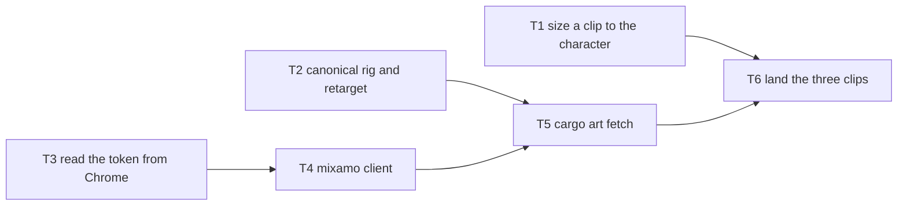

# Design: Canonical Rig And Animation Sources

## Context & Problem

`crates/xtask-art/src/library.rs` says motion is "declared once, reused by every
character on the same skeleton", but that is only half true. Its own header
admits the exception: `location` channels on `Hips`, `LeftShoulder` and `neck`
are "in the units of the rig it was bought against". Every clip in
`art/animations/` was bought from Meshy against the survivor, so the flaw is
invisible while he is the only character, and it becomes wrong the day a second
one exists. It also breaks sooner, because the survivor needs strafe clips and
a working backward walk that Meshy does not sell, and
`2026_08_19_decoupled_movement_and_aim.md` task T6 leaves that supplier
undecided. Mixamo has the clips, but a Mixamo clip is authored against Mixamo's
own body, with Mixamo's own bone names and a T-pose rest, so importing one
exposes the same coupling from the other side.

> **This is groundwork with only a partial consumer today, on purpose.** The
> strafe clips are a real consumer of the Mixamo source. The proportion
> normalisation and the per-skeleton framing have no second character to prove
> them. This project's usual rule sends speculative capability to Out of Scope,
> and that rule is set aside here deliberately, because the fix is cheap now and
> every extra character makes it more expensive.

## In Scope

- A named canonical rig per skeleton, so all motion is authored against one
  body, and foreign motion is fitted to it once, when it is fetched.
- The bake sizes a clip's translation to whichever character is playing it.
- Mixamo becomes a second motion source alongside Meshy, with its credential
  read from Chrome and the user guided when that fails.
- Every fetched file is checked and recorded, so a bad download fails loudly.
- The survivor gets `strafe_left`, `strafe_right` and a working `walk_back`.

## Out of Scope

- **Wiring the new clips into the game:** `Locomotion::StrafeLeft`,
  `Clip::StrafeLeft` and the four way `stride_of` stay in
  `2026_08_19_decoupled_movement_and_aim.md` task T6. This design stops at the
  packed atlases.
- **A second skeleton:** nothing non-humanoid exists, so none is created. The
  layout allows one; this design does not build one.
- **Any supplier beyond Meshy and Mixamo:** each would be a new `MotionSource`.
- **Uploading our own art to Mixamo:** the fitting step removes the reason to.
- **Matching gait phase or stride length automatically:** a clip being one whole
  cycle stays a review step, not a computed correction.
- **`cargo art fetch` on Windows or Linux:** the pipeline is macOS only, and CI
  never runs it.
- **Changing `GAIT_SECONDS`, `BACKWARD_SPEED` or `locomotion_frame`:** the
  renderer is untouched.

## Terminology

- **Skeleton:** a named bone layout, `"humanoid"` today. Already on
  `Animation::skeleton` and `Subject::skeleton`.
- **Canonical rig:** the one armature that defines a skeleton's bone names and
  rest pose. One file per skeleton.
- **Rest pose:** the bone layout an armature has with no animation applied. An
  action stores each bone's rotation relative to it, which is why two rigs in
  different rest poses cannot share an action untouched.
- **Retarget:** rewriting a clip so it drives a different rig. Here: renaming
  bones, dropping bones the canonical rig lacks, and re-expressing rotations
  against the canonical rest pose.
- **Motion source:** where a clip comes from, and so how it gets on disk.
  `MotionSource` in `library.rs`.
- **Product id, and bearer token:** Mixamo's stable UUID for one motion, and the
  short-lived Adobe credential a logged-in session holds, needed only to export.

## Key Decisions

### How does a shared clip stop being sized for one body?

Rotation channels are proportion independent. `location` channels are not: they
are lengths in the units of the rig they were authored against. A run's vertical
bob measured 0.095 units on the survivor, so on a character half his height that
bob is twice as large as it should be.

#### ✅ Option 1: Measure both rigs at bake time and scale

The animation GLB carries its own armature, because `--animation` is documented
as "armature + one action, no mesh" and glTF cannot store an action without one.
The character GLB carries the target armature. Both heights are already on disk.

```python
ratio = translation_scale(source_height, character_height)
scale_translation(action, ratio)  # every pose.bones[..].location curve
```

**Pros:** no new metadata, no declared numbers, no registry, no human
bookkeeping, and nothing that can go stale, because both numbers come from the
files being used. One clip file serves every character, which is the point of
the library. It composes with `strip_root_motion`, which keeps the vertical
channel on purpose: "Flattening the vertical one too would delete the run
cycle's bob".

**Cons:** total rest height is a proxy, so a long-legged character of the same
height gets a slightly wrong hip bob. The error is a fraction of 0.095 units.

**Rationale:** Accepted. The correction runs where both facts are known, and it
is impossible to forget. A third rejected idea, deleting the vertical channel
along with the horizontal ones, is already refused in writing by
`strip_root_motion`: the bob is animation, not travel, and a jump would then sit
on the ground.

#### ❌ Option 2: Declare the height, or buy every clip per character

```ron
"run": Animation(skeleton: "humanoid", authored_height: 1.7, ..),
// or: delete the "already in the library" check in stages::rig
```

**Pros:** a declared height needs no measurement code at all. Buying per
character gives every clip exactly the right body, with no maths.

**Cons:** a declared number is written by a human and checked by nobody, so a
wrong one is silent and stays wrong because nobody re-measures. Buying per
character deletes the shared library, costs credits per character per clip, and
Mixamo cannot retarget for us in the first place.

**Rationale:** Both rejected. The first is bookkeeping for a question the files
already answer, and the second solves the problem by removing the feature.

### What is the canonical rig, and where does it live?

There is one skeleton today. The declaration must not need redesigning for the
second one.

#### ✅ Option 1: A mesh-free GLB at a path derived from the skeleton name

`art/skeletons/humanoid.glb`, holding the armature and nothing else: the same
shape as an animation file, minus the action. There is no declaration anywhere,
because the path function is the declaration, exactly like
`AnimationLibrary::glb`.

```rust
/// The armature every clip for this skeleton is authored against.
pub fn reference_rig(root: &Path, skeleton: &str) -> PathBuf {
    root.join("art/skeletons").join(format!("{skeleton}.glb"))
}
```

**Pros:** a second skeleton is a second file and no code change, and the
skeleton name is already on `Animation` and `Subject`, so nothing new has to be
kept in step. It is a real artefact the retarget step reads, not a note in a
document, and it costs about 50 KB.

**Cons:** one more committed binary, produced once from the survivor's rig.

**Rationale:** Accepted. The smallest thing that code can use and that a new
file extends.

#### ❌ Option 2: A registry in `library.ron`, or a constant

```ron
skeletons: { "humanoid": Skeleton(reference: "survivor") },
// or: pub const HUMANOID_REFERENCE_CHARACTER: &str = "survivor";
```

**Pros:** the registry is visible in the file people already read, and the
constant puts nothing new on disk at all.

**Cons:** a registry is a second hand-maintained mapping that can point at a
deleted character, and it puts machine plumbing inside a hand-authored file. A
constant ties a skeleton to a character, so re-generating the survivor changes
the skeleton for every clip, and a second skeleton then needs a second constant
plus a lookup, which is the redesign this question exists to avoid.

**Rationale:** Both rejected. A derived path cannot disagree with itself, and a
skeleton should outlive any character on it.

### How does a foreign clip get onto our skeleton?

A Mixamo clip cannot be baked as it arrives, for three reasons, all provable
from code already in the repo:

- **Bone names.** Mixamo exports `mixamorig:Hips`, and its `Spine` is the
  lowest of its three where ours is the highest, so a name cannot pair two
  bones. `missing_bones` catches a bone we lack, never one driven wrongly.
- **Extra bones.** Mixamo's skeleton has fingers; ours is 24 bones with none.
- **Rest pose.** Mixamo's stock bodies are T-posed. Every character here is
  A-posed, because `CharacterType::pose_instruction` asks for "arms straight,
  angled 40 degrees DOWN and OUT" and notes "it matches the bind pose Meshy's
  animation rig uses". `bind_pose_mismatch` refuses anything over
  `BIND_POSE_TOLERANCE_DEG = 15.0`, and `framing.py` says "64 degrees apart is a
  T-pose against an A-pose".

#### ✅ Option 1: Fit the clip to the canonical rig once, when it is fetched

A new Blender step reads `art/skeletons/humanoid.glb` and the download, then
writes an animation GLB carrying the canonical armature and one action.

```python
rename_to_canonical(action, matched)         # by role, out of the role map
drop_unmatched_curves(action, matched)       # fingers, and anything else
rebase_rotations(action, source, canonical)  # the rest pose difference
scale_translation(action, canonical_height / source_height)
```

**Pros:** every file in `art/animations/` then has the same armature, which is
what "single canonical rig" actually means. A supplier is one table in the
skeleton's role map. It is the same idiom as `apply_forearm_roll`, which
already composes a fixed rotation onto every keyframe of a rotation curve.

**Cons:** a T-pose to A-pose rebase is exact in maths but changes how the mesh
deforms at the shoulder, because skinning is not linear in the joint angle.
After a rebase, the bind pose guard can no longer catch a bad source clip, only
a drifted character rig.

**Rationale:** Accepted. What every engine does, and it fixes names too.
Renaming this rig to Mixamo's spelling instead is rejected: these are Meshy's
names, Meshy re-rigs every new character, and every Meshy clip arrives with
them, so the rename would break the paid source once per character.

#### ❌ Rejected alternatives

- **Upload our own body to Mixamo and buy against it**, giving `character_id`
  our survivor. No rebase maths, and the rest pose problem mostly disappears.
  Rejected: it fixes neither `mixamorig:` names nor finger bones, so most of the
  work remains. It also sends all rights reserved art (`art/LICENSE`) to a third
  party, and rests on undocumented behaviour, since Mixamo builds its own
  skeleton and whether an export keeps the uploaded rest pose is unstated.
- **Raise `BIND_POSE_TOLERANCE_DEG` to 70.** One number, no new code. Rejected:
  the arms would sit about 50 degrees wrong in every frame, and the guard would
  stop catching the mismatches it exists for. It turns a loud failure into a
  silent one.

### Where does Mixamo motion enter the pipeline?

Meshy motion arrives inside `Stage::Rig`, because Meshy only produces a clip
attached to a rig task it billed for. Mixamo has no such tie.

#### ✅ Option 1: A new `cargo art fetch`, outside the per-character run

```console
cargo art fetch                 # every library entry with no GLB yet
cargo art fetch walk_back --force
```

**Pros:** the library is global and the lock is per character, so global work
does not belong in a per-character stage. It gives the interactive Chrome login
one obvious home, run once by a human, and it changes no `Stage`, so no
committed lock file is invalidated. A missing clip already fails clearly at bake
time; the message just needs to name this command.

**Cons:** two ways for motion to arrive. A reader must learn that Meshy is
bought during a rig and everything else is fetched.

**Rationale:** Accepted. The two providers genuinely have different shapes, and
pretending otherwise would force a fake rig task.

#### ❌ Option 2: A new `Stage::Fetch`, or an arm inside `stages::rig`

```rust
pub enum Stage { Concept, Model, Fetch, Rig, Download, Bake, Pack }
// or, inside stages::rig:
MotionSource::Mixamo { product_id } => mixamo::fetch(product_id, &dest).await?,
```

**Pros:** one pipeline and one mental model, and `plan` already handles
ordering, caching and confirmation. The `rig` arm would put every "the library
lacks this clip" case in one place.

**Cons:** stages are fingerprinted per character against `spec.lock`, and this
work is per library, so every committed lock file would change and running the
survivor would re-check clips that have nothing to do with him. The `rig` arm is
worse still: it calls `meshy::Client::from_env()` first, so a Mixamo-only fetch
would demand `MESHY_API_KEY`.

**Rationale:** Rejected. Both file shared state under one character, and both
put an interactive browser prompt in the middle of a paid pipeline.

### How does the tool get a Mixamo bearer token?

Search needs no credential, confirmed by an unauthenticated request returning
HTTP 200. `POST /animations/export` returns HTTP 401 without one, also
confirmed. So exactly one call needs a token.

#### ✅ Option 1: Read it from Chrome, and open Chrome when it is missing

Chrome keeps site storage in a LevelDB under
`~/Library/Application Support/Google/Chrome/<profile>/Local Storage/leveldb`.
Reading it needs no macOS permission grant. Expiry is decoded from the token, so
no network call is needed to know it is stale.

```rust
let token = match chrome::mixamo_token()? {
    Some(token) => token,
    None => {
        println!("Log in to Mixamo in the Chrome window that just opened.");
        open_chrome("https://www.mixamo.com/")?;
        chrome::wait_for_token(Duration::from_secs(120))?
    }
};
```

**Pros:** the user never touches devtools, which they asked for. Nothing is
stored: the token is read fresh each run and never logged, and Chrome's profile
is readable with no grant at all, verified. Expiry is local arithmetic, so a
stale token never reaches the network, and `MARROWFALL_MIXAMO_TOKEN` overrides
the whole path for CI and tests.

**Cons:** depends on Chrome's on-disk layout, a convention not a standard, and
reads a credential from another application's data directory.

**Rationale:** Accepted, and both halves were proved before this was written.

#### ❌ Rejected alternatives

- **Paste the token from devtools**, `MARROWFALL_MIXAMO_TOKEN=eyJhbGci... cargo
  art fetch`. About ten lines, no LevelDB and no browser control. Rejected by
  the user, who does not want to touch devtools, and a 24 hour token makes it a
  daily chore. The variable stays as the CI escape hatch.
- **Read Safari instead**, which is on every Mac. Rejected: `~/Library/Safari`
  is blocked by macOS TCC and needs Full Disk Access, verified. A small feature
  must not ask for the largest permission macOS has.
- **Log in to Adobe headlessly with a stored password.** Fully unattended, so CI
  could fetch. Rejected: it stores a real credential, and Adobe's login has MFA
  and bot detection, so it would break often. A bad trade for a daily click.

### How is a download proved good?

Mixamo's API is undocumented and can change without notice. A wrong response
that still parses is the dangerous case.

#### ✅ Option 1: Check the shape before converting, and record a fingerprint

Two guards with two jobs. The check runs every time and stops bad bytes. The
record proves later which upstream motion produced a committed file.

```rust
anyhow::ensure!(bytes.starts_with(b"Kaydara FBX Binary"), "not an FBX: {head}");
anyhow::ensure!(bytes.len() > MIN_FBX_BYTES, "truncated, {} bytes", bytes.len());
```

```ron
"walk_back": Fetched(
    source: Mixamo(product_id: "c9ccc468-b96c-11e4-a802-0aaa78deedf9"),
    download: "3f7a1c9e0b24d581",  // fnv1a of the FBX
    glb: "91b0c4de77a2f316",       // fnv1a of what we committed
),
```

**Pros:** the shape check catches the failure that actually happens, an HTML
error page or a truncated body returned with a success status. A sidecar lock
beside a hand-authored RON file is the pattern `spec.ron` plus `spec.lock`
already uses, and reusing `lock::fnv1a` adds no dependency, per that file's own
reasoning: "avoiding a hashing dependency keeps the tool's dependency surface
small".

**Cons:** FNV-1a detects change, it does not resist an attacker. The record only
fires on a deliberate re-fetch, because the GLB is committed.

**Rationale:** Accepted, with the limits stated rather than glossed.

#### ❌ Option 2: A cryptographic hash, or git alone

```toml
sha2 = "0.10"      # or: rely on `git diff --stat art/animations/`
```

**Pros:** SHA-256 is the standard answer for content addressing and is collision
resistant. Git costs nothing at all, since the GLB is committed anyway.

**Cons:** a crypto crate is a new dependency for a threat model with no
attacker, against a choice already recorded in `lock.rs`. Git records that
something changed but not what, because a GLB diff is opaque and says nothing
about which upstream product or export settings produced it.

**Rationale:** Both rejected. Consistency with the existing hash beats novelty,
and git alone loses the provenance that is the whole point.

### Does the backward clip need exempting from the shared gait cycle?

`draw::GAIT_SECONDS = 20.0 / 24.0` plays every locomotion clip over one 0.833
second cycle, so the fraction through a stride carries across a clip change.
Every unarmed backward clip Mixamo has is a *walk*, and the game backs away at
`BACKWARD_SPEED = 0.55`. From constants in the repo: `run` covers 3.33 tiles per
cycle and backing away covers 1.83.

#### ✅ Option 1: No exemption, and tune the speed if it reads wrong

```rust
pub const GAIT_SECONDS: f64 = 20.0 / 24.0; // unchanged
pub const BACKWARD_SPEED: f32 = 0.55;      // the dial, if it reads wrong
```

**Pros:** keeps the pop-free clip change on the action performed most, turning
while running. No new renderer state, and `locomotion_frame` stays a pure
function of `snapshot.time`. Both strafes are *running* strafes at full speed,
so only one clip is even in question.

**Cons:** a walk squeezed into 0.833 seconds steps faster than authored while
the body covers 55 percent of the ground. The prediction is a backward glide,
which has to be judged on screen rather than argued here.

**Rationale:** Accepted, with the check written into T6. Nothing is measured
yet, only predicted, and the first fix to try is one constant.

#### ❌ Option 2: Give the clip its own cycle length

```rust
Clip::WalkBack => sprites::frame_at(atlas, seconds), // its own fps
```

Plays exactly as authored, so its own foot slide is minimal. Rejected: it
reintroduces the leg jump at every forward to backward switch, the fault
`GAIT_SECONDS` exists to remove, trading a common problem for a rare one.

#### ❌ Option 3: Scale the cycle by the current speed

```rust
let cycle = GAIT_SECONDS / speed_factor; // needs an accumulated phase
```

Cadence would always match ground speed, for every clip and every future speed
modifier. Rejected for now: a varying rate cannot be a function of absolute
time, so the renderer would need a per-entity phase accumulator, which is new
state in the one crate that derives everything from the snapshot. It is the
right answer if speed ever becomes continuous, and a design of its own.

### Where do third party motion files live?

`ozturkberkay/marrowfall` is public and `.gitattributes` sends `*.glb` through
git-lfs, so anything under `art/animations/` is published. The two providers
disagree about whether that is allowed, so one rule cannot cover both.

#### ✅ Meshy committed, Mixamo not

Meshy's paid plan, which this project is on, grants "full private ownership of
all assets you create with Meshy" and "full rights to distribute and sell them".
Adobe permits embedding a Mixamo clip in a game and sharing it inside a team,
and forbids redistributing the raw files, naming asset packages that ship them
as the product. A public repository is that.

Expressed as a property of the source rather than a list of filenames:

```rust
impl MotionSource {
    /// Whether the source file itself may be published. The baked atlases
    /// always may: they are the licensed use.
    pub const fn redistributable(&self) -> bool {
        !matches!(self, Self::Mixamo { .. })
    }
}
```

`AnimationLibrary::glb` resolves a non-redistributable clip under a gitignored
`art/animations/local/`. A future provider is one boolean, not a licence audit.

**Pros:** Meshy motion costs credits, and `library.rs` says it is "Bought once,
then shared by every character", so committing it stops a second person paying
again. Mixamo motion is free, so excluding it costs only a login, and only to
re-bake: the committed atlases mean building and playing needs no account.

**Cons:** two rules instead of one, and the pipeline must know which is which.

**Rationale:** Accepted. The only legal split that keeps the library shared.

#### ❌ Rejected alternatives

- **Commit everything, amend the licence.** Carving third party motion out of
  `art/LICENSE` fixes the false ownership claim, since today's text asserts all
  rights reserved over "animation data" the project does not own. It leaves the
  breach, because the files are still published.
- **Commit no source files.** One rule, but every contributor re-buys the Meshy
  motion, which defeats the shared library.
- **Make the repository private.** Adobe permits sharing inside a team, so the
  conflict disappears and every file stays. Far too large a change for something
  a `.gitignore` entry solves.

### Do the three existing Meshy clips move to the canonical rig too?

They were bought against the survivor, who is the body the canonical rig is a
copy of.

#### ✅ Option 1: Leave them, and let the bake normalise them

```ron
"run": Animation(skeleton: "humanoid", loops: true, fps: 24, source: Meshy(action_id: 15)),
```

**Pros:** their source armature already is the canonical rig, so their measured
ratio is 1.0 today and the correct ratio for any future character automatically.
Re-buying would cost three Meshy charges for no visible change.

**Cons and rationale:** accepted, at the price of one comment. Re-generating the
survivor would move his rig away from the canonical one, leaving the old clips
authored against a body no file describes, so the canonical rig must be
regenerated deliberately and never as a side effect.

#### ❌ Option 2: Re-buy them against the canonical rig now

```console
cargo art run survivor --from rig --retry
```

**Pros:** every clip in the library then has the same provenance.

**Cons and rationale:** rejected. The Meshy path cannot buy against a bare
armature, because it needs a mesh and therefore a character, so this is not
currently possible at all, and it would buy nothing.

## Architecture Overview

Two new paths joining flows that already exist. Nothing in `crates/game`,
`crates/host`, `crates/render` or `crates/sprites` changes.

```text
  FETCH (new, run by a human, once per clip)

  library.ron ── name + Mixamo(product_id)
        ▼
  cargo art fetch ──► chrome::mixamo_token ──► Chrome LevelDB copy
        │                    └ missing or expired: open Chrome, poll, continue
        ▼
  mixamo::Client  search ─► product (gms_hash) ─► export ─► monitor ─► FBX
        ▼  art/staging/downloads/<name>.fbx   (gitignored)
  retarget_animation.py  ◄── art/skeletons/humanoid.glb  (the canonical rig)
        │   rename bones, drop extras, rebase rotations, scale translation
        ▼
  art/animations/<name>.glb  +  art/animations/library.lock   (both committed)

  BAKE (existing, one step added)

  model.glb (character armature) ──┐
  <name>.glb (canonical armature) ─┴─► measure both rest heights
        ▼  scale this action's location curves
  apply_forearm_roll ─► strip_root_motion ─► measure_framing ─► render
```

Each correction sits where its facts are known. Bone names, extra bones and rest
pose belong to the skeleton and are the same for every character on it, so they
are fixed once at fetch time. Translation size belongs to the character playing
the clip, so it cannot be baked into the shared file.

## Third Party Dependencies

| Capability | Chosen | Alternatives considered | Why |
| --- | --- | --- | --- |
| Read Chrome's Local Storage | `rusty-leveldb` 4.0.1 | `leveldb` (C++ bindings), `rocksdb`, a Python reader, parsing `.ldb` by hand | Pure Rust, five small dependencies, no system library. Proved against the real profile before this was written: 32 entries across 4 origins. Released 2025-10-28, so it is maintained. |
| Read the token's expiry | `base64` and `serde_json`, both already present | `jsonwebtoken`, `jwt`, `biscuit` | We are not the token's audience and must not verify its signature, so a crypto crate is dead weight. Decoding one claim is a few lines. |
| Fingerprint a download | `lock::fnv1a`, already in the crate | `sha2`, `blake3`, `md-5` | Detecting change, not resisting an attacker. `lock.rs` already made and documented this choice. |
| FBX to GLB, plus the retarget | Blender, already required | `FBX2glTF` (archived), `assimp`, `ufbx` | The retarget needs Blender regardless, and `tools/blender` already has tests and a virtualenv. A converter would be a second toolchain for half the job. |
| Open a browser at a URL | `std::process::Command` running `open -a` | `webbrowser` crate, `xdg-open` | One command on the only platform this tool runs on. |

HTTP reuses `reqwest`. No new Godot node and no new workspace crate.

## Structure

```text
crates/xtask-art/src/
  library.rs   MotionSource::Mixamo { product_id }; reference_rig(); the Fetched
               record and the library lock's load/save
  mixamo.rs    new. Client: search, product, export, monitor, download
  chrome.rs    new. mixamo_token(), wait_for_token(), jwt expiry
  cli.rs       Command::Fetch { names, force }; fetch()
  stages.rs    bake's error message names `cargo art fetch`; the retarget
               invocation reuses blender_command_bare
  lock.rs      fnv1a becomes pub(crate); LOCAL_PIPELINE_VERSION 2 -> 3
  tests/unit/  test_mixamo.rs and test_mixamo_client.rs mirroring the meshy
               pair, test_chrome.rs (a LevelDB in a temp dir plus jwt expiry),
               and test_library.rs for the new variant and the library lock

tools/blender/src/
  retarget_animation.py  new. The Blender half of the fit
  framing.py             rest_height, translation_scale, SkeletonRoles,
                         loop_mismatch. All pure, all unit tested
  bake_sprites.py        take_action returns the source height; a
                         scale_translation fix-up before strip_root_motion

art/
  skeletons/humanoid.*    new. The canonical rig, and its role map
  animations/library.ron  walk_back's source replaced; two strafes added
  animations/library.lock new. Machine-owned fetch record
  animations/*.glb        walk_back replaced; strafe_left, strafe_right added
  characters/survivor/spec.ron  the two new animation names
  staging/downloads/      already gitignored, via the /art/staging/ rule
```

`art/skeletons/` sits beside `art/animations/` and `art/characters/` because a
skeleton is a third kind of shared art, not a property of either.

## Specs & Standards

- **glTF 2.0, section 3.6 Animations.** An `animation.channel.target.path` is
  one of `translation`, `rotation`, `scale` or `weights`. Only `translation`
  carries a length, which is why only that path is scaled. Section 3.7 Skins is
  why a joint hierarchy only survives export as part of a skin, and therefore
  why `strip_animation.py` keeps a one-triangle carrier mesh and the retarget
  must do the same. <https://registry.khronos.org/glTF/specs/2.0/glTF-2.0.html>
- **RFC 7519, section 4.1.4 (`exp`).** The expiry claim is seconds since the
  epoch, and a token is rejected on or after it. Section 7.2 lists validation
  steps; we deliberately skip signature verification, because Mixamo is the
  audience and the verifier and we only need to know when to re-prompt.
  **RFC 7515 section 2** and **RFC 4648 section 5** govern the encoding: JWS
  uses base64url, which swaps `+` and `/` for `-` and `_` and drops padding, so
  the decoder must re-pad first. <https://www.rfc-editor.org/rfc/rfc7519>
- **RFC 6585, section 4** defines HTTP 429, optionally with `Retry-After`, which
  Mixamo returns. **RFC 9110, section 11.6.2** covers the `Authorization:
  Bearer` scheme used on the export call.
  <https://www.rfc-editor.org/rfc/rfc6585>
- **RON grammar** (canonical EBNF in `ron-rs/ron`, `docs/grammar.md`) governs
  `library.ron` and the new `library.lock`.
  <https://github.com/ron-rs/ron/blob/master/docs/grammar.md>
- **Chromium Local Storage layout.** Not a standard. Keys are
  `_<origin>\x00\x01<key>`, and values carry a one byte encoding prefix, `\x00`
  for UTF-16 and `\x01` for Latin-1. Documented by forensic analysis rather than
  by Google, so the reader treats every part as untrusted input and fails with a
  clear message instead of asserting.
  <https://www.cclsolutionsgroup.com/post/chromium-session-storage-and-local-storage>
- **Neither the FBX format nor Mixamo's API is documented by its owner.**
  Community analysis records a 20 byte `Kaydara FBX Binary  \x00` header, used
  here only as a sanity check that the bytes are not an error page. Every Mixamo
  endpoint below was exercised directly before this was written and is
  independently visible in community tools, so the client treats every response
  as raw JSON and fails clearly on an unexpected shape, as `meshy.rs` does.
  Its skeleton is undocumented too, so `humanoid.toml` follows pixiv's
  `three-vrm` map, reading `Spine`, `Spine1`, `Spine2` as spine, chest, upper
  chest. <https://github.com/pixiv/three-vrm>
- **Mixamo licence.** Adobe's FAQ grants royalty-free use of animations in
  personal, commercial and non-profit projects with no credit required, and
  forbids redistributing character or animation raw files as the product.
  <https://helpx.adobe.com/creative-cloud/faq/mixamo-faq.html>

## Interfaces

### Mixamo HTTP

Base `https://www.mixamo.com/api/v1`. Every request carries `X-Api-Key: mixamo2`
and `Accept: application/json`, and the export also carries
`X-Requested-With: XMLHttpRequest`.

| Call | Method and path | Auth | Returns |
| --- | --- | --- | --- |
| Search | `/products?page=1&limit=96&order=&type=Motion&query=<text>` | none | Paged products, each with a stable UUID |
| Product | `/products/{product_id}?similar=0&character_id={cid}` | none | `details.gms_hash` |
| Export | `POST /animations/export` | bearer | Accepted, then poll |
| Monitor | `/characters/{cid}/monitor` | bearer | `status`, and `job_result` (the FBX URL) when `completed` |

```json
{
  "character_id": "<a Mixamo stock body>",
  "type": "Motion",
  "product_name": "Backward Walk",
  "gms_hash": [ { "model-id": 0, "mirror": false, "inplace": false } ],
  "preferences": { "format": "fbx7", "skin": "false", "fps": "30" }
}
```

- `gms_hash` is opaque. It is read from the product call and echoed unchanged,
  so fields such as `mirror` and `inplace` keep the provider's defaults. The
  bake pins horizontal root travel anyway, so `inplace` does not matter to us.
- `character_id` selects which body Mixamo renders the motion onto. The retarget
  discards that body, so any stock Mixamo character works. Its UUID is a
  constant in `mixamo.rs`, found once with `type=Character` on the search
  endpoint, in the same spirit as `meshy::RIGS`. Mixamo has no non-humanoid
  motion, so a per-skeleton mapping would be dead generality.
- `preferences` also carries `reducekf: "0"`, asking for unreduced keys. The
  bake resamples with `sampled_frames`, so the source rate only bounds how
  smooth that resample can be.
- Verified before this design: search returns HTTP 200 with no credential, and
  export returns HTTP 401 without one. **Not yet verified: the exact monitor
  path and its polling shape.** It is community-documented and matches the
  table, and confirming it is the first success criterion of the client task.

### `MotionSource` and the library lock

```rust
pub enum MotionSource {
    Meshy { action_id: u32 },
    /// Fetched from Mixamo by product id, then retargeted onto the canonical
    /// rig. Free, so `costs_credits` stays false.
    Mixamo { product_id: String },
    Authored,
}
```

Adding a variant makes every `match` fail to compile, which is the point.
`lock::fingerprint` must keep ignoring non-Meshy sources for `Stage::Rig`, since
only Meshy ids decide whether a paid rig has to run again.

`art/animations/library.lock` is a sidecar to `library.ron`, for the reason
`lock.rs` gives: keep the hand-authored file diffable, and let a re-run skip
completed work. It is keyed by library name, so it lines up with `library.ron`
and with the GLB. `download` and `glb` are `fnv1a` hex, the format
`lock::fingerprint` already writes. A name whose GLB is missing is re-fetched; a
name whose GLB hash does not match is reported, never silently overwritten.

### `cargo art fetch` and `retarget_animation.py`

```console
$ cargo art fetch [NAME]... [--force]

$ blender --background --python-use-system-env \
    --python tools/blender/src/retarget_animation.py -- \
    --source art/staging/downloads/walk_back.fbx \
    --rig art/skeletons/humanoid.glb --convention mixamo \
    --out art/animations/local/walk_back.glb --name walk_back
```

- No names means every library entry whose GLB is missing and whose source can
  be fetched. `MotionSource::Meshy` is skipped with a line saying it arrives
  with the rig stage, and `MotionSource::Authored` is skipped as `stages::rig`
  does. The token is requested only if a clip actually needs fetching, so a
  no-op run never opens a browser. One clip at a time, as Mixamo rate limits.
- `--source` accepts `.fbx` or `.glb`, chosen by extension. `--convention` names
  one table of the role map, declared by `MotionSource::bone_convention` rather
  than sniffed from bone names, which can be wrong and silent. It exits non-zero
  naming any role the source or the rig leaves unfilled, and warns, without
  failing, when a clip's first and last poses differ: a judgement call.
- `bake_sprites.py` gains no flag, so `stages::bake` needs no change, and
  `take_action` returns the source rest height for the new fix-up.

## Existing Code & Reuse

- **`strip_animation.py`'s `skin_carrier`** already solves "glTF cannot export a
  lone armature". The retarget reuses that function rather than reinventing it.
- **`apply_forearm_roll`** is the precedent for composing a fixed rotation onto
  every keyframe of a quaternion curve, including the 4-curve grouping and the
  handle updates. The rest pose rebase is the same shape with a different
  constant per bone. **`action_fcurves`** already spans Blender's two action
  APIs, and every new curve edit goes through it.
- **`bone_directions`, `bind_pose_mismatch` and `missing_bones`** stay as they
  are. After a retarget they compare the canonical rig against the character,
  which is the direction worth checking.
- **`AnimationLibrary::glb`** already derives an animation path from a name, and
  `reference_rig` is the same idea for a skeleton, in the same file.
- **`Lock` and `StageRecord`** are *not* reused for the library lock: they are
  keyed by `Stage` and scoped to one character. The new record borrows the
  pattern, not the type. **`lock::fnv1a`** becomes `pub(crate)` and is reused, so
  no second hash appears in the crate.
- **`meshy::Client`** is the template for `mixamo::Client`: a `reqwest` client,
  a base URL overridable by a `MARROWFALL_*` variable, `decode` turning HTTP
  errors into messages that quote the server, and a poll loop with an interval
  and a deadline. `test_meshy_client.rs` is the template for its tests, and
  **`stages::blender_command_bare`** builds the Blender invocation unchanged.
- **`LOCAL_PIPELINE_VERSION`** exists for exactly this: "Bump whenever its
  output changes for identical inputs." It goes from 2 to 3.

## Logic

### Measuring a rig, and sizing its clip

The animation GLB has an armature and a one-triangle carrier, so
`evaluated_bounds` is useless. Rest bone positions are the measurement, and they
are pose independent by definition. `rest_height` is the vertical span of an
armature's rest bone heads and tails.

```python
def translation_scale(source: float, target: float) -> float:
    """How much to grow a clip's lengths for this character."""
    if not (math.isfinite(source) and math.isfinite(target)) or source <= 0:
        raise ValueError(f"cannot size a clip from {source} and {target}")
    ratio = target / source
    if not 0.2 <= ratio <= 5.0:
        raise ValueError(f"ratio {ratio:.2f} outside 0.2..5.0, wrong rig?")
    return ratio
```

Both are pure, so both are unit tested. The Blender side reads `bone.head_local`
and `bone.tail_local` through `armature.matrix_world`, so an armature object
with a non-identity scale is measured in the same space as the character's. A
failure exits with the message, never with a silent 1.0, matching how
`take_action` already handles a rig mismatch. Every `location` curve is then
scaled by the ratio, keyframe values and both handles, not only the three curves
that happen to be non-zero today, because a constant offset is a length too.
Order is fixed: scale first, then `strip_root_motion`, which flattens the
horizontal channels to their first frame value, an anchor that should already be
scaled.

### Matching a foreign bone to a canonical one

By anatomical role, out of `art/skeletons/<skeleton>.toml`, never by name.
`Spine` is this rig's highest spine bone (`Hips -> Spine02 -> Spine01 ->
Spine`) and Mixamo's lowest (`Hips -> Spine -> Spine1 -> Spine2`), so a name
match takes the wrong motion and leaves two bones undriven, twisting the torso.
A role no bone fills is an error naming it; a bone with no role has its curves
dropped, which covers fingers. Namespace and case are ignored.

### Rebasing rotations onto the canonical rest

A bone's channel holds its rotation relative to its own rest, measured against
its parent. Making the posed result identical on a rig with a different rest
needs one fixed correction per bone, built from the two parent-relative rest
matrices and composed onto every keyframe.

```python
delta = canonical_rest_to_parent.inverted() @ source_rest_to_parent
rebased = delta.to_quaternion() @ current
```

**The composition order is settled by test, not by this snippet.** Blender's
bone spaces are easy to get backwards, and `framing.py`'s own comments say
measured beats assumed. Two tests pin it: retargeting a clip onto its own rig
must leave every curve unchanged, and retargeting the committed `run.glb` must
produce a bake indistinguishable from today's.

### Finding the token

```rust
/// A JWT is three base64url segments. Take the one with the latest `exp`.
fn newest_token(values: &[String]) -> Option<Token> {
    values.iter().filter_map(jwt_like).filter_map(expiry).max_by_key(|t| t.exp)
}
```

- Chrome holds an exclusive lock on the LevelDB while it runs, so the directory
  is copied to a temporary location and the copy is opened. Entries are read for
  the Mixamo origin only, and the value's first byte is an encoding tag that is
  stripped before decoding. `LdbIterator` must be in scope for `.next()`.
- The entry is found by shape, not by a hardcoded key name: any value containing
  a JWT-shaped string with an `exp` claim. Adobe can rename its storage key
  without breaking this, which matters on a surface nobody documents.
- The token is returned by value, used once, and dropped. It is never printed,
  never written to disk, and never put in an error message.

## Edge Cases & Constraints

- **Building the game needs no Mixamo account.** The baked atlases are
  committed, so a contributor clones and plays. Only re-baking a Mixamo clip
  needs the fetch, and the bake names the missing file and the command.
- **Mixamo's API is undocumented and can change silently.** Every response is
  parsed as raw JSON and a missing field fails with the endpoint named, as
  `meshy.rs` already does. It rate limits with HTTP 429 (RFC 6585 section 4), so
  clips are fetched one at a time and a 429 backs off rather than failing.
- **The licence permits the use but forbids redistributing raw animation
  files.** This repo commits `art/animations/*.glb` to a public remote through
  git-lfs, and `art/LICENSE` currently reserves all rights over "animation
  data". **Both need a human decision before the clips are committed.** Neither
  is an engineering question and neither is settled here.
- **The first `cargo art fetch` needs a human at the machine**, to log in to
  Mixamo in Chrome. Later runs within 24 hours reuse the live session. Chrome's
  LevelDB is locked while Chrome runs, hence the copy, which is deleted when the
  read finishes. Several profiles are possible, so `Default` is tried first and
  then every `Profile *`, taking the newest valid token.
- **The token never leaves memory.** No file, no log, no error message. A leaked
  bearer token is an Adobe account credential.
- **CI runs Linux and never runs `cargo art`.** The Chrome reader must still
  compile there, and `MARROWFALL_MIXAMO_TOKEN` plus a LevelDB built in a temp
  directory is what makes it testable without Chrome.
- **A Mixamo clip animates finger bones the humanoid lacks.** They fill no role
  so the retarget drops them, invisible at 240 pixels anyway.
- **A retargeted clip makes `bind_pose_mismatch` vacuous on the source side**,
  because the source armature becomes the canonical rig. It still guards the
  character, which is the direction that actually drifts.
- **Left and right are only verifiable on screen.** `stride_of` defines
  `StrafeLeft` as the character's own left. A swapped pair compiles, passes
  every test, and is obvious the moment it is played.
- **`art/animations/walk_back.glb` must be deleted when its source changes**, or
  both `stages::rig` and `cargo art fetch` see a file on disk and skip the
  replacement. Changing that source also changes the `Stage::Rig` fingerprint,
  because action id 544 leaves the list, but `plan` then sees an unfinished
  stage with the checkpoint GLB on disk and reports `skipped (checkpoint GLB
  already on disk)`, so no Meshy credits are re-spent. Verified in `cli::plan`.
- **`LOCAL_PIPELINE_VERSION` 2 to 3 re-bakes and re-packs every character**, of
  which there is one, and it is minutes. **`pack::character_scale` fits one crop
  across every animation**, so adding two clips changes the sprite scale: every
  atlas and the manifest regenerate together, and no atlas may be added alone.
- **A clip that is not one whole cycle hitches**, which is the bug the current
  `walk_back` has. `loop_mismatch` warns at retarget time; the judgement stays
  human. **The backward glide is predicted, not measured**, per the gait
  decision.
- **`art/staging/downloads/` would collide with a character named `downloads`**,
  which `spec.validate` allows. Nothing is called that, and the bake only clears
  its own subdirectory.
- **The canonical rig must not be regenerated casually.** Re-running the
  survivor's model stage produces a new rig; `art/skeletons/humanoid.glb` stays
  as it is unless every clip is refitted. A comment says so.

## Test Plan

Tiers follow `README.md`. Everything is unit tier: nothing new crosses a thread
boundary and nothing new launches Godot.

**`tools/blender` (pytest, 100 percent coverage on `framing.py`)**

- `rest_height` on a known set of points, on a single-bone rig, and on an empty
  set. `translation_scale` returns 1.0 for equal heights, the ratio for unequal
  ones, and raises for zero, negative, non-finite and out-of-band inputs.
- `bare_bone_name` drops a namespace and the case. `SkeletonRoles` pairs
  Mixamo's `Spine` with our `Spine02`, refuses a convention filling a different
  set of roles, and names a role no rig fills. `loop_mismatch` reports nothing
  for a matching first and last pose, and names the worst bones otherwise.

**`crates/xtask-art` (`cargo nextest run --workspace --test unit`)**

- The JWT decoder reads `exp`, rejects too few segments, rejects unparseable
  base64url, rejects a payload with no `exp`, handles missing padding, and
  treats an expired token as absent. `MARROWFALL_MIXAMO_TOKEN` skips Chrome.
- The Chrome reader finds a token in a LevelDB built in a temp directory, strips
  the value's encoding prefix, ignores other origins, picks the latest `exp`
  when several exist, and returns `None` for an empty profile. It runs on Linux
  CI with no Chrome present, which is the point.
- `mixamo::Client` against `wiremock`: search parses products, the product call
  extracts `gms_hash`, the export posts the documented body with the bearer
  header, the monitor loop polls until `completed`, a 401 says the token is
  stale, a 429 backs off, an HTML body fails with the endpoint named, and a
  response missing `job_result` fails rather than downloading nothing. The FBX
  shape check rejects an HTML error page and a truncated body.
- `MotionSource::Mixamo` round-trips through RON, `costs_credits` is false for
  it, and `lock::fingerprint` for `Stage::Rig` is unchanged when only a Mixamo
  entry is added, so a paid stage cannot be invalidated by a free one. The
  library lock loads, saves with a trailing newline, and treats a missing file
  as empty, mirroring `test_lock.rs`.
- `cli::fetch` planning: no names fetches only missing entries, Meshy and
  authored entries are skipped with a reason, `--force` re-fetches, and a run
  with nothing to do never asks for a token.

**By hand, once, recorded in the task:**

- Retargeting `run.glb` onto the canonical rig leaves every curve unchanged, and
  its bake produces the same frame counts, anchors and cell sizes as the
  committed manifest. A hand-downloaded Mixamo FBX passes `bake_sprites.py`
  after the retarget and fails before it, which is the proof this rests on.
- A deliberately scaled copy of the survivor's rig bakes with the hip bob at the
  right size. This is the only end-to-end proof of the normalisation available
  until a second character exists, and it is manual because `bpy` cannot run
  under pytest.

**By playing the game**, in the consuming task rather than here: the survivor
backs away without hopping, strafes with his feet pushing the correct way, and
does not glide. Deliberately untested, per Out of Scope: any second skeleton,
any supplier beyond Mixamo, Windows and Linux fetching, and the stride wiring.

## Documentation Changes

Each change ships in the task that makes it true.

- **`art/LICENSE`:** the all rights reserved claim covers the project's own art.
  Third party motion is governed by its provider's terms, naming Meshy and
  Mixamo. Today's text asserts ownership of "animation data" the project does
  not own.
- **`README.md`:** the monorepo layout gains `art/skeletons/`, and Local
  Development says shared clips are fetched with `cargo art fetch`, whose first
  run opens Chrome and waits for a Mixamo login.
- **`crates/xtask-art/src/library.rs`:** the header currently ends by admitting
  translation is "in the units of the rig it was bought against". Replace that
  with the two-part rule: motion is fitted to the canonical rig when it is
  fetched, and sized to the character when it is baked.
- **`art/animations/library.ron`:** the `walk_back` known-bad comment goes with
  the clip, and each new entry names its Mixamo product in a comment, since a
  UUID reads as nothing. **`art/skeletons/README.md`** is new and short: what a
  canonical rig is, that `humanoid.glb` came from the survivor's rig, and that
  regenerating it means refitting every clip.
- **`tools/blender/src/retarget_animation.py`:** a module docstring in the style
  of `strip_animation.py`, explaining the three fixes and why each is needed.
  `bake_sprites.py`'s `strip_root_motion` docstring gains a sentence saying the
  vertical channel it keeps has already been scaled.
- **`crates/xtask-art/src/chrome.rs`:** a header saying plainly that this reads
  another application's storage, why (a 24 hour token, and no devtools), and
  that nothing is persisted.

## Development Environment Changes

- **`.gitignore`:** add `art/animations/local/`, where motion whose licence
  forbids redistributing the source file resolves.
- **`Brewfile`:** add `cask "google-chrome"`. The fetch path depends on it, and
  onboarding should not discover that at the prompt.
- **`crates/xtask-art/Cargo.toml`:** add `rusty-leveldb`. Its licence has to
  pass `cargo deny`, whose allow list is permissive only, so that is checked in
  the task rather than assumed here.
- **New environment variables**, both `MARROWFALL_` prefixed per `CLAUDE.md`:
  `MARROWFALL_MIXAMO_TOKEN` supplies the bearer token and skips Chrome, for CI
  and tests; `MARROWFALL_MIXAMO_BASE_URL` points the client at a local server,
  matching `MARROWFALL_MESHY_BASE_URL`, for tests only.
- No change to `scripts/`, the workflows, `pyproject.toml` or the Godot project.
  CI never runs `cargo art`, so no secret is added to any workflow.

## Tasks



T1, T2 and T3 have no dependencies and run in parallel. **T2 comes before any
API work on purpose:** it uses one Mixamo FBX downloaded by hand from the
website, so the riskiest question, whether a Mixamo clip can be made to bake at
all, is answered before a line of client code exists. If T2 fails, T3 to T6 are
wasted, and this ordering makes that cheap to discover.

| #   | Task Name | Task Description | Success Criteria | Dependencies |
| --- | --------- | ---------------- | ---------------- | ------------ |
| T1 | Size a clip to the character | Add `rest_height` and `translation_scale` to `framing.py`. Have `take_action` measure and return the source armature's rest height, and add a `scale_translation` fix-up that runs before `strip_root_motion`. Bump `LOCAL_PIPELINE_VERSION` to 3. Re-bake and re-pack the survivor. | The `framing.py` tests pass with coverage still at 100 percent. A bad or missing measurement exits with a named error, never a silent 1.0. The re-baked survivor's manifest has the same frame counts, anchors and cell sizes as today, because his ratio is exactly 1.0. A scaled stand-in rig bakes with a correspondingly scaled hip bob, checked by hand and recorded. | none |
| T2 | The canonical rig and the retarget step | Produce `art/skeletons/humanoid.glb` from the survivor's rigged model, armature only. Add `SkeletonRoles`, `art/skeletons/humanoid.toml` and `loop_mismatch`. Write `retarget_animation.py`: rename, drop unmatched curves, rebase rotations onto the canonical rest, scale translation to canonical units, export a GLB with a skin carrier. Prove it on one hand-downloaded Mixamo FBX. | Retargeting `run.glb` onto the canonical rig leaves its curves unchanged and its bake output unchanged. A hand-downloaded Mixamo FBX fails `bake_sprites.py` before the retarget and passes after it, and the baked frames show correct arms rather than a T-pose offset. A clip with a Mixamo spine chain drives `Spine02`, not `Spine`. An unfilled role exits non-zero naming it. `framing.py` coverage stays at 100 percent. | none |
| T3 | Read the Mixamo token from Chrome | Add `chrome.rs`: copy the profile LevelDB, read the Mixamo origin's entries, strip the value encoding prefix, find a JWT by shape, decode `exp` per RFC 7519, and return the newest valid token or `None`. Add `MARROWFALL_MIXAMO_TOKEN`. Add `rusty-leveldb`. | The unit tests in the Test Plan pass on Linux CI with no Chrome installed. `cargo deny` stays green. The token appears in no log, no file and no error message, checked by reading every format string in the module. Confirmed by hand on the real profile that a live Mixamo session yields a token and a logged-out one yields `None`. | none |
| T4 | The Mixamo client | Add `mixamo.rs` modelled on `meshy.rs`: search, product, export, monitor and download, with `MARROWFALL_MIXAMO_BASE_URL` for tests. Confirm the monitor path against the live API. Add the FBX shape check. | The `wiremock` tests in the Test Plan pass. Against the live API, searching for "Backward Walk" returns product `c9ccc468-b96c-11e4-a802-0aaa78deedf9`, and one export completes and downloads a valid FBX. A 401, a 429 and an HTML body each produce a message that names the endpoint and quotes the server. | T3 |
| T5 | `cargo art fetch` and the library lock | Add `MotionSource::Mixamo`, `AnimationLibrary::reference_rig`, the `art/animations/library.lock` record, and `Command::Fetch`. Wire the token prompt: open Chrome, explain, poll to a timeout, continue. Call `retarget_animation.py` through `blender_command_bare`. Update the bake's missing-animation message. Make `fnv1a` `pub(crate)`. | The unit tests in the Test Plan pass. A run with nothing to fetch never opens a browser. With no valid token, Chrome opens at Mixamo, the terminal says why, and the fetch continues by itself once the user logs in. A Meshy entry is skipped with a reason, and `lock::fingerprint` for `Stage::Rig` is provably unchanged by adding a Mixamo entry. | T2, T4 |
| T6 | Land the three clips. **Needs the human present for the first login.** | Replace `walk_back`'s source with the Mixamo product `c9ccc468-b96c-11e4-a802-0aaa78deedf9` and delete the stale GLB. Add `strafe_left` (`c9c97b90-b96c-11e4-a802-0aaa78deedf9`) and `strafe_right` (`c9c96f9e-b96c-11e4-a802-0aaa78deedf9`). Add both names to the survivor's spec. Run `cargo art fetch`, then re-bake and re-pack. Commit the lock, the atlases and the manifest. The three Mixamo GLBs are **not** committed: they resolve under the gitignored `local/` path. | All three GLBs are on disk under `local/` with matching lock entries, and `git status` shows none of them. `loop_mismatch` reports nothing worth fixing, and each clip is one whole cycle starting on the same foot, judged by eye. The committed manifest parses with 16 rows for all five clips. **The spine is checked first:** Mixamo's `Spine`, its lowest, must drive `Spine02`, this rig's lowest. T2's role map does that; a twisted torso means it did not. The strafe pair is confirmed on screen as left and right the right way round, and the backward clip is judged for glide, with `BACKWARD_SPEED` as the only dial if it needs one. | T1, T5 |

The two strafes are a matched pair rather than two unrelated captures: Mixamo's
internal motion ids are 117610901 and 117610902, and the shared prefix marks one
session. That is why they start on the same foot as each other, and also why
they might not match `run`, which is what T6 checks. After T6,
`2026_08_19_decoupled_movement_and_aim.md` task T6 has its art and becomes a
pure code change: widen `Locomotion` and `Clip`, and `stride_of` to four.
